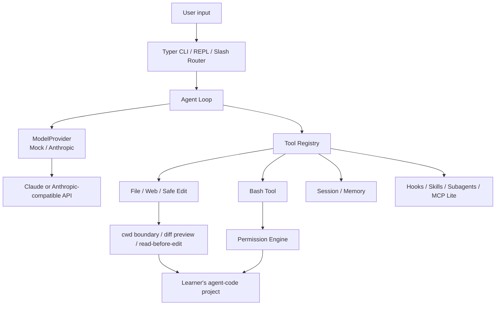
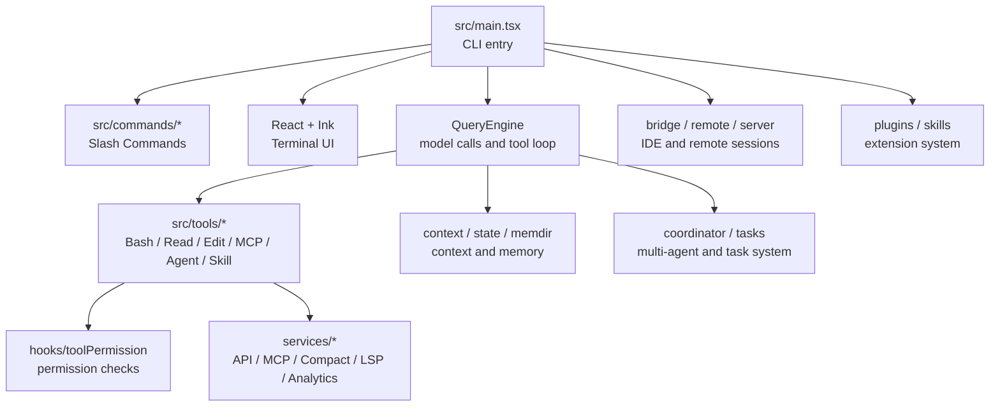

# Build a Claude Code CLI by Hand in 14 Days

[中文](./README.md)

This is a teaching project for building a Claude Code style Code Agent CLI from scratch in Python. The goal is not to clone Claude Code as a product. The goal is to learn the harness around the model: CLI runtime, Agent Loop, tool calling, permissions, file editing, shell execution, session memory, hooks, skills, subagents, worktrees, and MCP-style tool ecosystems.

By the end, you will have a runnable CLI called `agent-code`: a small code agent that can read files, edit files, run commands, manage context, and keep a feedback loop with the model.

## Why This Project Exists

I have wanted to study Agent Harness engineering for a while, but I did not know where to begin. Someone told me that instead of reading scattered articles, I should study how a real product like Claude Code is designed.

Around that time, a publicly visible Claude Code source snapshot became available. I used AI to help me read through the architecture first: which capabilities are first-class tools, which parts live in the CLI runtime, and which parts belong to the harness outside the model.

After that pass, I decided to turn the learning path into a 14-day tutorial. This project does not translate the official TypeScript code into Python. It rewrites the core ideas in a smaller, runnable, teaching-friendly way. Every day adds one visible harness boundary.

The whole project is also built with a lot of AI collaboration. If some writing, translation, or explanation still feels too AI-flavored, please open an issue or PR. This project is meant to improve in the open.

## What You Will Build

The final CLI is called `agent-code`. It gradually learns to:

- accept one-shot prompts or run an interactive terminal REPL
- call a real model and handle `tool_use` / `tool_result`
- search, read, and summarize project files
- preview diffs and apply safer file edits
- run bash commands behind a permission system
- persist sessions and load project memory
- support slash commands, hooks, skills, and subagents
- isolate work with git worktrees and extend tools through MCP / ToolSearch

In one sentence: the model reasons, while the harness manages context, tools, permissions, execution, state, and the feedback loop.

## Default Test Model

The main tutorial uses the Anthropic Messages API shape: `tool_use`, `tool_result`, and `input_schema`. To keep the project cheaper and easier to test, the default real-model setup uses DeepSeek's Anthropic-compatible endpoint:

```bash
export ANTHROPIC_AUTH_TOKEN="sk-..."
export ANTHROPIC_BASE_URL="https://api.deepseek.com/anthropic"
```

The exact model name follows each day's document and snapshot code. The main path commonly uses `deepseek-v4-flash`. If you want to use official Claude or another compatible provider, keep the Anthropic Messages API shape and change the token, base URL, and `--model`.

## 14-Day Path

The first 7 days build a useful single-agent CLI. The next 7 days upgrade it into a fuller Claude Code style harness.

| Day | Topic | Harness concept |
|---|---|---|
| 1 | Hello Agent | CLI, REPL, MockProvider, minimal Agent Loop |
| 2 | Real Model + Tool Calling | AnthropicProvider, `tool_use` / `tool_result` |
| 3 | File + Web Tools | cwd boundary, file reading, search, web tools |
| 4 | Safe Edit | read-before-edit, string replacement, diff preview |
| 5 | Bash + Permission | shell execution, permission requests, background tasks |
| 6 | Session + Memory | session JSONL, project memory, memdir |
| 7 | Slash + Hooks | slash commands, hooks, cron `/loop` |
| 8 | TodoWrite + Plan Mode | planning mode, todo state, execution constraints |
| 9 | Skills | on-demand knowledge and workflows |
| 10 | Subagents | subagent dispatch and result handoff |
| 11 | Context Compact | long-context compaction and cost tracking |
| 12 | Agent Coordinator | small multi-agent coordination |
| 13 | Worktree + Final Demo | worktree isolation and end-to-end coding tasks |
| 14 | MCP + ToolSearch | MCP client, tool discovery, tool authoring |

The repository currently includes the first 7 days of tutorials and runnable snapshots. Days 8-14 will continue on the same route.

## Getting Started

If you are following the tutorial, start from Day 1 and keep modifying your own `agent-code` project:

```bash
open docs/day-01-hello-agent.md
```

If you only want to run a completed daily snapshot:

```bash
cd packages/day-01-hello-agent
uv sync
uv run agent-code "say hi with the echo tool"
uv run pytest
```

When testing a specific day, enter that day's directory first so pytest does not collect same-named tests from multiple snapshots:

```bash
cd packages/day-02-real-model-tool-calling
uv run pytest
```

## Web Version

There is also a web version of the tutorial. Its source lives in `agent-code-learn/`. To preview it locally:

```bash
cd agent-code-learn
npm install
npm run dev
```

Then open `http://localhost:3000`. The current web project metadata points at `buildcc.dev`; if the public site is not available yet, the local preview is the most reliable way to read it.

## Teaching Version Architecture



## Claude Code Source Architecture Reference

`reference/claude-code-official/` is a local research copy of a publicly visible Claude Code source snapshot. We use it to understand architectural boundaries. We do not copy the official TypeScript source, prompts, or internal protocol text into the tutorial.



## Repository Structure

```txt
docs/                          14-day tutorials
packages/day-*/                runnable teaching snapshots for each day
demo/                          current integrated demo project
agent-code-learn/              web version of the tutorial
```

One important note: learners are not supposed to create a new `packages/day-*` directory every day. Those directories are reference snapshots. The learning flow is to keep evolving your own `agent-code` project from Day 1 to Day 14.

## Feedback Welcome

Issues, discussions, and PRs are very welcome, especially for:

- commands that fail or produce output different from the tutorial
- explanations that are hard to follow
- inaccurate Claude Code architecture interpretations
- DeepSeek / Claude / compatible endpoint behavior differences
- awkward English translation
- web layout, interaction, or code diff problems

If you are also studying Agent Harness engineering, please bring your questions, debugging notes, and suggestions. The useful part of this project is not just finishing a tutorial. It is learning how to take apart the outer engineering system around a real code agent.

## Disclaimer

This is an educational implementation. We reference the public Claude Code source snapshot under `reference/claude-code-official/` to understand its architecture, but rewrite everything in Python with teaching-friendly simplifications. It is not affiliated with Anthropic.

## License

MIT
