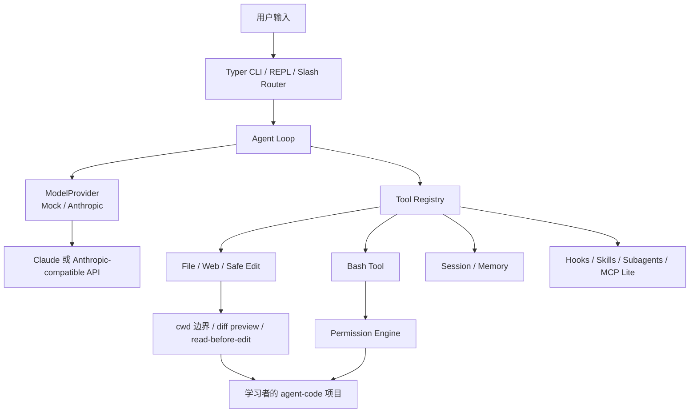

# 14 天手搓 Claude Code CLI

[English](./README.en.md)

这个项目是一个教学版 Code Agent CLI。我们用 Python 从零实现一个 Claude Code 风格的 `agent-code`，重点学习模型外层那套 harness：CLI 运行时、Agent Loop、工具调用、权限、文件编辑、命令执行、会话记忆、hooks、skills、subagents、worktree 和 MCP 工具生态。

它不是 Claude Code 的完整复刻，也不追求产品级能力。目标更简单：跟着 14 天教程，把一个能读代码、改文件、跑命令、管理上下文的代码 Agent 一步步手写出来。

## 为什么做这个项目

我一直想系统学 Agent Harness，但一开始不知道从哪里下手。后来有人跟我说，与其泛泛看文章，不如直接研究 Claude Code 这种真实产品是怎么设计的。

正好前段时间有一份 Claude Code 源码快照公开可见，我就先让 AI 带着自己读了一遍，看看官方把哪些能力当成一等工具，哪些逻辑放在 CLI runtime，哪些逻辑放在模型外层的 harness 里。

读完以后，我决定把这条学习路径重新整理成教程：不用 TypeScript 复刻官方实现，而是用学习者更容易跑起来的 Python，把核心机制拆成 14 天。每一天都能运行，每一天都能看见一个新的 harness 边界。

整个过程也大量使用了 AI 协作。如果你觉得某些文案、翻译或者解释有一点 AI 味，欢迎直接提 issue 或 PR。这个项目本来就是边学边改出来的。

## 你会做出什么

最后的 CLI 叫 `agent-code`。它会逐步具备这些能力：

- 接收一次性 prompt 或进入终端 REPL
- 调用真实模型，并处理 `tool_use` / `tool_result`
- 搜索、读取和总结项目文件
- 在写文件前做安全检查和 diff preview
- 执行 bash 命令，并通过权限系统保护危险操作
- 保存会话，读取项目记忆，压缩上下文
- 支持 slash commands、hooks、skills 和 subagents
- 用 worktree 隔离任务，并通过 MCP / ToolSearch 扩展工具

一句话：模型负责推理，harness 负责上下文、工具、权限、执行、状态和反馈循环。

## 默认测试模型

教程主线使用 Anthropic Messages API 的消息形状，也就是 `tool_use`、`tool_result` 和 `input_schema`。为了降低测试成本、让更多人能跑起来，项目默认用 DeepSeek 的 Anthropic-compatible endpoint 做真实模型测试：

```bash
export ANTHROPIC_AUTH_TOKEN="sk-..."
export ANTHROPIC_BASE_URL="https://api.deepseek.com/anthropic"
```

教程示例默认模型以当天文档和快照代码为准，主线常用 `deepseek-v4-flash`。如果你想换成官方 Claude 或其他兼容服务，只要保留 Anthropic Messages API 的协议形状，改 token、base URL 和 `--model` 即可。

## 14 天路线

前 7 天先做出一个能用的单 Agent CLI，后 7 天把它升级成更完整的 Claude Code 风格 harness。

| Day | 主题 | 学到的 harness 能力 |
|---|---|---|
| 1 | Hello Agent | CLI、REPL、MockProvider、最小 Agent Loop |
| 2 | Real Model + Tool Calling | AnthropicProvider、`tool_use` / `tool_result` |
| 3 | File + Web Tools | cwd 边界、文件读取、搜索、网页工具 |
| 4 | Safe Edit | read-before-edit、字符串替换、diff preview |
| 5 | Bash + Permission | 命令执行、权限请求、后台任务 |
| 6 | Session + Memory | 会话 JSONL、项目记忆、memdir |
| 7 | Slash + Hooks | slash command、hooks、cron `/loop` |
| 8 | Interactive Shell + Plan Mode | 交互式 shell、TodoWrite、Plan Mode 审批闭环 |
| 9 | Skills | 按需加载知识和工作流 |
| 10 | Subagents | 子 Agent 派发和结果回填 |
| 11 | Context Compact | 长上下文压缩、成本追踪 |
| 12 | Agent Coordinator | 极简多 Agent 协作 |
| 13 | Worktree + Final Demo | worktree 隔离、端到端代码任务 |
| 14 | MCP + ToolSearch | MCP 客户端、工具发现、工具扩展 |

当前仓库已经包含前 8 天的教程和参考快照。后续内容会继续在同一条路线里补齐。

## 怎么开始

如果你是跟教程学习，从 Day 1 文档开始，在自己的 `agent-code` 项目里持续修改：

```bash
open docs/day-01-hello-agent.md
```

如果只想运行仓库里的完成版参考快照：

```bash
cd packages/day-01-hello-agent
uv sync
uv run agent-code "用 echo 工具说 hi"
uv run pytest
```

测试某一天时，建议进入对应目录再跑，避免 pytest 从仓库根目录收集到多个 day 的同名测试文件：

```bash
cd packages/day-02-real-model-tool-calling
uv run pytest
```

## 网页版

这个项目还有一个网页教程版本，源码在 `agent-code-learn/`。本地预览：

```bash
cd agent-code-learn
npm install
npm run dev
```

然后打开 `http://localhost:3000`。线上站点按当前网页项目元信息使用 `buildcc.dev`，如果你访问时还没部署好，可以先用本地预览。

## 教学版项目架构



## 项目结构

```txt
docs/                          14 天教程文档
packages/day-*/                每一天独立可运行的教学快照
demo/                          当前综合 demo 项目
agent-code-learn/              网页版教程

```

注意：教程读者不是每天新建一个 `packages/day-*`。这些目录是参考答案快照。真正学习时，我们是在自己的 `agent-code` 项目里从 Day 1 持续改到 Day 14。

## 欢迎反馈

欢迎提 issue、discussion 或 PR，尤其是这几类：

- 某一步命令跑不通，或者输出和文档对不上
- 教程里某段解释不清楚
- Claude Code 架构理解有偏差
- DeepSeek / Claude / 兼容 endpoint 的运行差异
- 英文翻译不自然
- 网页版排版、交互或代码 diff 有问题

如果你也在研究 Agent Harness，欢迎把你的问题、踩坑记录和改进建议一起丢过来。这个项目最有价值的部分，不是“我写完了一个教程”，而是大家能把一个真实代码 Agent 的外层工程系统拆开看懂。

## 声明

This is an educational implementation. We reference the publicly visible Claude Code source snapshot to understand its architecture, but rewrite everything in Python with teaching-friendly simplifications. It is not affiliated with Anthropic.

## License

MIT
