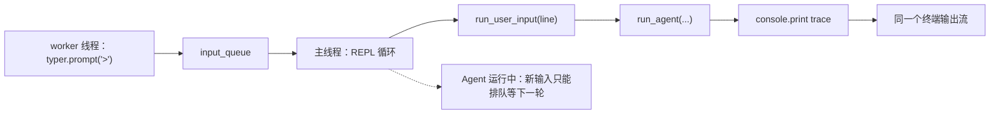
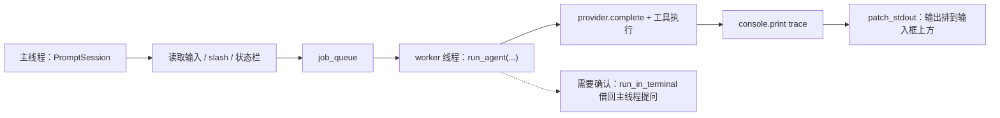
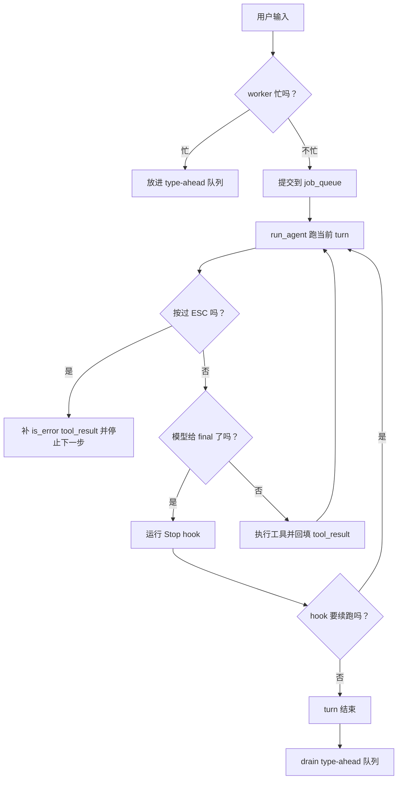
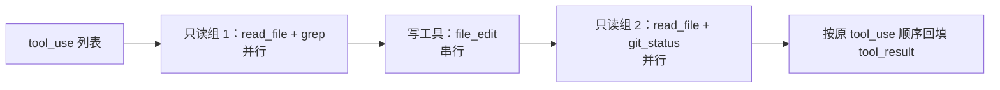
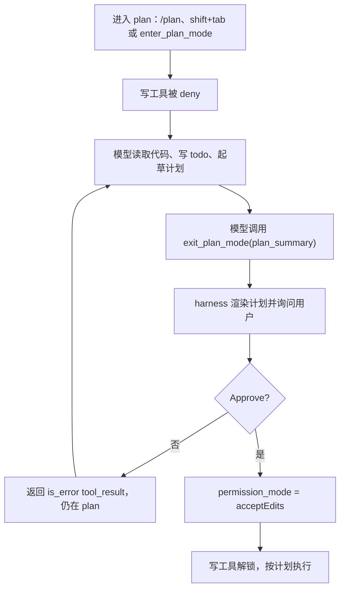

# Day 8：交互式 Shell + Plan Mode 闭环

前 7 天，我们从零搭了一个能跑通的单 Agent CLI：模型接入、文件工具、安全编辑、bash 执行、权限控制、三层记忆、slash/hooks/cron。

每一步都刻意保持简单：

- `console.print` 直接往终端打。
- `typer.prompt` 阻塞等输入。
- `permission_mode` 和 `model` 是启动时写死的局部变量。

这些简化让你先看清 Agent Loop 的骨架，不被交互细节分心。

从今天起，后 7 天把 `agent-code` 从"一次性脚本"抬成"常驻交互运行时"。篇幅会长一些，因为问题变了——不再是"能不能跑通"，而是"手感对不对、运行时状态谁来管"。

今天要做的是：把"敲一句 → 打印 trace → 退出"换成一个真正的交互 shell。

它会有这些东西：常驻输入框、上方滚动输出、模式/模型运行时切换、ESC 中断、多工具并发、todo 待办板、Plan Mode 审批闭环。

跑完之后你会看到：

- 终端底部一直有个 `>` 等你输入，Agent 回答时 trace 滚在上方，输入框不被冲走
- `shift+tab` 在 `default → acceptEdits → plan` 三模式间循环，状态栏即时变化
- `ESC` 安全中断正在跑的任务；运行中打的新输入排到队列，turn 结束后接着跑
- 模型一轮调 3 个 `read_file` 时它们并行跑完；中间夹一个 `file_edit` 就自动分组成串行
- Plan Mode 下模型写完计划，只有你点了 Approve，harness 才解锁 `file_write`/`file_edit`

代码约 1200 行，新增约 600 行。

今天分六个版本：

1. v1 把输入/输出分层。
2. v2 加键位和运行时模式/模型切换。
3. v3 给 turn 加生命周期控制。
4. v4 做多工具并发。
5. v5 上 todo 待办板。
6. v6 收束到 Plan Mode 审批闭环。

## 起手：今天的起点

从 Day 7 的 `agent-code` 项目继续改。先跑一下现在的 REPL，亲眼看看痛点在哪：

```bash
$ uv run agent-code
Agent Code
cwd: /your/project
provider: anthropic  model: deepseek-v4-pro

输入 /help 查看命令，输入 /exit 退出。
>: 读一下 agent_code/cli.py 然后说说它做了什么
tool_call: read_file {'path': 'agent_code/cli.py'}
observation: ...
final: cli.py 负责 ...
>:
```

这时能看到几个麻烦：

1. Agent 回答时，`tool_call` / `observation` / `final` 直接打在终端里，和你下一行要输入的内容混在一起。
2. Agent 跑的时候你也敲不了字，`typer.prompt` 要等这一轮整个跑完才会重新读输入。
3. 更别说切模式、切模型、中途喊停。

新增依赖：

```bash
$ uv add prompt_toolkit
```

`prompt_toolkit` 提供一个比 `typer.prompt` 强得多的输入组件：常驻底部、键位绑定、状态栏、多线程下安全重绘。它是今天 v1 的核心。

今天会新增两个文件、改八个文件：

```txt
新增  agent_code/interactive.py   交互 shell：PromptSession + 键位 + 状态栏 + 线程
新增  agent_code/runtime.py       共享运行态 RuntimeState
改    agent_code/cli.py           REPL 分支换成 run_interactive_shell
改    agent_code/agent.py         run_agent 收 state；abort 检查；并发编排；exit_plan_mode 拦截；Stop hook
改    agent_code/tools.py         Tool 加 is_read_only；ToolContext 加 runtime_state；todo / plan 工具；ToolRegistry.get
改    agent_code/permissions.py   放行 todo_*/plan 工具；plan 模式写工具 deny
改    agent_code/slash.py         /model 运行时切换；/plan 热切；/todo；SlashContext 加 state
改    agent_code/prompt_ui.py     确认 UI 借回终端（run_in_terminal）；confirm_plan
改    agent_code/hooks.py         Stop 事件 run_hooks_raw
改    agent_code/fs_safety.py     ReadFileState.record 加锁
```

## v1：交互式 shell 骨架

### Day 7 的 REPL 卡在哪里

我们在 Day 7 实现的 REPL，已经为了 cron 做过一层线程拆分。运行顺序是：

1. 后台 `_read_input()` 用 `typer.prompt(">")` 等输入。
2. 主线程从 `input_queue` 拿到一行。
3. 主线程跑完整个 Agent Loop，所有 `console.print` 直接打终端。
4. 跑完这一轮，再处理下一行。

这条线大概长这样：



后面的能力都会卡在这几个点上：

1. Agent 跑的时候，新的输入最多只是排队，看不到清楚的运行状态。
2. 输出和输入共用同一个终端写流，`tool_call` / `observation` 很容易把输入行冲乱。
3. Day 7 把"输入"放在 worker 线程，主线程跑 Agent。我们可以想一下，这是不是反了？输入框应该常驻、不被打断，所以**输入必须在主线程**。

所以 v1 先把线程方向反过来：

1. 主线程跑 `prompt_toolkit.PromptSession`，负责常驻输入框和状态栏。
2. 用户提交后，主线程把文本丢给 worker 线程。
3. worker 线程跑 `run_agent`。

线程一拆开，有两个直接后果：

- worker 的输出要安全地打到输入框上方，这靠 `patch_stdout` 接管 stdout。
- worker 要问你问题时，得借回终端，这靠 `run_in_terminal`。

这两件事 v1 一起接上。

v1 之后，线程关系会变成这样：



### 1.1 新增 `agent_code/runtime.py`——共享运行态

Day 7 的 `permission_mode` 和 `model` 是 `cli.py` 主循环里的局部变量。现在它们要在主线程（输入/UI）和 worker 线程（Agent Loop）之间共享，所以提出来成一个对象。

```python
"""agent_code/runtime.py — 跨主线程 / worker 线程共享的运行态。"""

from __future__ import annotations

import queue
import threading
from dataclasses import dataclass, field


@dataclass
class RuntimeState:
    # 主线程（输入/键位/状态栏）写这些；worker 线程（Agent Loop）读这些。
    permission_mode: str = "default"      # default | acceptEdits | plan，shift+tab 改它
    model: str = "deepseek-v4-pro"        # /model 改它，下一轮 turn 生效
    provider: str = "anthropic"
    abort_event: threading.Event = field(default_factory=threading.Event)  # ESC 置位，loop 步间检查
    input_queue: "queue.Queue[str]" = field(default_factory=queue.Queue)   # type-ahead，turn 末 drain
```

`threading.Event` 是线程安全的标志位，ESC 置位、Agent Loop 步间检查（v3 用）。`queue.Queue` 做 type-ahead 输入队列（v3 用）。v1 先把这两个字段放好，后面版本直接接。

### 1.2 新增 `agent_code/interactive.py`——交互 shell 主体

主线程建 `PromptSession`，slash 命令在主线程直接处理，普通输入丢 worker 跑。worker 的 trace 靠 `patch_stdout()` 打在上方。

```python
"""agent_code/interactive.py — prompt_toolkit 交互 shell。

主线程 = PromptSession（输入、键位、状态栏 + slash 分派）；
worker 线程 = run_agent（阻塞 provider.complete + 工具执行）。
"""

from __future__ import annotations

import asyncio
import queue
import threading
from typing import Any, Callable

from prompt_toolkit import PromptSession
from prompt_toolkit.application import run_in_terminal
from prompt_toolkit.key_binding import KeyBindings
from prompt_toolkit.patch_stdout import patch_stdout

from . import prompt_ui
from .runtime import RuntimeState
from .slash import SlashContext, dispatch_slash


def run_interactive_shell(
    state: RuntimeState,
    run_turn: Callable[[str], None],            # worker 调它跑一轮 Agent Loop
    make_slash_context: Callable[[], SlashContext],
) -> None:
    """启动交互 REPL。主线程读输入 + 分派 slash，worker 线程跑 Agent Loop。"""
    job_queue: "queue.Queue[str]" = queue.Queue()

    def worker_loop() -> None:
        while True:
            text = job_queue.get()              # 阻塞等任务
            if text == "__EXIT__":
                break
            state.abort_event.clear()           # 新 turn 开始，清掉上一轮残留的 ESC
            run_turn(text)

    worker = threading.Thread(target=worker_loop, daemon=True)
    worker.start()

    session: PromptSession[str] = PromptSession(
        key_bindings=build_key_bindings(state),
        bottom_toolbar=lambda: bottom_toolbar(state),
    )

    async def _run() -> None:
        # get_running_loop()：拿到 prompt_async 真正在跑的那条事件循环。
        # 线程拆开后，worker 要问用户（确认编辑、批准计划）不能直接抢 stdin——
        # terminal_asker 用 run_coroutine_threadsafe 把提问调度到这条循环上，
        # run_in_terminal 暂停输入框、问完再恢复，worker 阻塞在 .result() 等结果。
        # set_terminal_asker 在 1.5 的 prompt_ui 里定义。
        loop = asyncio.get_running_loop()

        def terminal_asker(func: Callable[[], Any]) -> Any:
            return asyncio.run_coroutine_threadsafe(run_in_terminal(func), loop).result()

        prompt_ui.set_terminal_asker(terminal_asker)

        # patch_stdout：worker 线程里 run_agent 的 console.print 会被安全地排到输入框上方
        with patch_stdout():
            while True:
                try:
                    text = (await session.prompt_async("> ")).strip()
                except (KeyboardInterrupt, EOFError):
                    break
                if not text:
                    continue
                if text == "/exit":
                    break
                # slash 是 harness 控制面，主线程直接处理，不丢给模型
                if text.startswith("/"):
                    result = dispatch_slash(text, make_slash_context())
                    if result.handled:
                        if result.message:
                            print(result.message)
                        if result.should_query:
                            job_queue.put(result.prompt)
                        continue
                job_queue.put(text)

    asyncio.run(_run())             # 在这条事件循环上跑 prompt_async 读输入
    job_queue.put("__EXIT__")


def build_key_bindings(state: RuntimeState) -> KeyBindings:
    """v1 先只绑 ESC。v2 加 shift+tab。"""
    kb = KeyBindings()

    @kb.add("escape")
    def _(event: Any) -> None:
        state.abort_event.set()                 # 只置标志，真正的中断在 Agent Loop 步间处理（v3）

    return kb


def bottom_toolbar(state: RuntimeState) -> str:
    """底部状态栏——当前模式 + 模型。"""
    mode = {"default": "default", "acceptEdits": "accept edits", "plan": "plan"}.get(
        state.permission_mode, state.permission_mode
    )
    return f" {mode} · {state.model} "
```

`patch_stdout()` 是这一版的关键。

它做三件事：

1. 在 `with` 块内把 `sys.stdout` 换成一个代理。
2. 任何线程往 stdout 打内容，都会被排到 `prompt_toolkit` 的输入框上方。
3. worker 线程里 `run_agent` 的 `console.print` 不会冲掉输入行。

输出靠 `patch_stdout` 上去。输入这一侧，worker 要确认编辑、批准计划时，靠 `terminal_asker` 借回主线程。

这里的流程分四步：

1. worker 线程没有 `prompt_toolkit` 的 app 上下文，不能自己 `run_in_terminal`。
2. `terminal_asker` 用 `run_coroutine_threadsafe` 把提问丢回主线程事件循环。
3. `run_in_terminal` 暂停输入框、展示确认 UI、拿到答案。
4. worker 阻塞在 `.result()`，等答案回来再继续跑工具。

为什么输入循环要放进 `async def _run()`，再用 `asyncio.run(_run())` 跑？

因为我们要在 `_run()` 里调用 `get_running_loop()`，拿到那条**确定正在跑 `prompt_async` 的事件循环**。

`terminal_asker` 调度到这条循环上，才不会落空。两个线程各管一头，不抢 stdin。

### 1.3 改 `agent_code/agent.py`——`run_agent` 收 `RuntimeState`

`permission_mode` 不再是参数，改成从共享的 `state` 读。这样 worker 在每一轮都能拿到最新模式（v2 的 shift+tab 改的就是它）。

找到 `run_agent` 的签名，把 `permission_mode` 那个参数换成 `state`：

```python
from .runtime import RuntimeState   # 顶部 import 区新增

def run_agent(
    prompt: str,
    provider: ModelProvider,
    tools: ToolRegistry,
    max_steps: int = 8,
    cwd: Path | None = None,
    state: RuntimeState | None = None,   # 原来是 permission_mode: str = "default"
    session: Session | None = None,
    system_prompt: str | None = None,
) -> AgentResult:
    resolved_cwd = cwd or Path.cwd()
    state = state or RuntimeState()       # one-shot 没传就用默认
    ctx = ToolContext(
        cwd=resolved_cwd,
        skip_policy=SkipPolicy.default(gitignore=load_gitignore(resolved_cwd)),
        runtime_state=state,             # 新增：todo / plan 工具靠它读写共享态
    )
    ...
```

往下找到构造 `PermissionRequest` 的那一行，把 `mode=permission_mode` 改成 `mode=state.permission_mode`：

```python
            request = PermissionRequest(
                tool_name=call.name,
                args=call.arguments,
                mode=state.permission_mode,   # 原来是 mode=permission_mode
                cwd=ctx.cwd,
            )
```

`run_agent` 的其余逻辑（hooks、文件校验、ask/deny 分支、工具执行、tool_result 回填）这一版都不动。

还有一处连带改动容易漏：`permission_mode` 这个参数没了。

所以凡是还在这样调的地方都会挂：

```python
run_agent(..., permission_mode=...)
```

Day 6/7 跟下来，如果你在 `tests/test_smoke.py` 里写过这种调用，就会撞上。改成：

```python
run_agent(..., state=RuntimeState(...))
```

文件顶部记得加：

```python
from agent_code.runtime import RuntimeState
```

否则 `uv run pytest` 会抛：

```txt
TypeError: run_agent() got an unexpected keyword argument 'permission_mode'
```

### 1.4 改 `agent_code/tools.py`——`ToolContext` 加 `runtime_state`

`run_agent` 给 `ToolContext` 传了 `runtime_state`，所以 `ToolContext` 要有这个字段。后面 v5 的 `todo_write`、v6 的 `enter_plan_mode` 都靠它读写共享态。

找到 `ToolContext` 的定义，加一个字段：

```python
from .runtime import RuntimeState   # 顶部 import 区新增

@dataclass
class ToolContext:
    cwd: Path
    skip_policy: SkipPolicy = field(default_factory=SkipPolicy.default)
    read_state: ReadFileState = field(default_factory=ReadFileState)
    runtime_state: RuntimeState | None = None   # Day 8：工具读写共享运行态的入口
```

### 1.5 改 `agent_code/prompt_ui.py`——确认 UI 借回终端

Agent 跑在 worker 线程，确认 UI 不能直接 `typer.confirm`，不然会和主线程的 `PromptSession` 抢 stdin。

1.2 的 `terminal_asker` 已经把"借回终端"接好了。`prompt_ui.py` 这边只留一个注入点：

- 交互 shell 启动时，把 asker 塞进来。
- one-shot 模式不塞 asker，直接用原来的 `typer.confirm` 问。

在 `prompt_ui.py` 顶部加注入点和 helper：

```python
_terminal_asker = None   # 交互 shell 启动时由 interactive.py 注入；one-shot 保持 None


def set_terminal_asker(asker) -> None:
    global _terminal_asker
    _terminal_asker = asker


def _ask(func):
    """worker 要问用户时走这里。交互 shell 注入了 asker → 丢回主线程事件循环问；
    one-shot 没注入（_terminal_asker is None）→ 直接问。"""
    if _terminal_asker is not None:
        return _terminal_asker(func)
    return func()
```

然后把现有的三个确认函数和单选函数各包一层 `_ask`（函数签名不变，只把原来的调用塞进 `_ask(lambda: ...)`）：

```python
def confirm_edit(path: str) -> bool:
    return _ask(lambda: typer.confirm(f"Apply this edit to {path}?", default=False))


def confirm_command(command: str) -> bool:
    return _ask(lambda: typer.confirm("Run this command?", default=False))


def confirm_tool_use(tool_name: str, detail: str) -> bool:
    return _ask(lambda: typer.confirm(f"Allow {tool_name}: {detail}?", default=False))
```

`prompt_single_choice` 同理，把读取选择那段 `typer.prompt(...)` 包进 `_ask`。`render_diff` 是纯字符串渲染，不读输入，不用动。

### 1.6 改 `agent_code/cli.py`——REPL 分支换成交互 shell

先在 `cli.py` 顶部 import 区加 `from .runtime import RuntimeState`——`run_once` 也要用它，所以放模块级，不能只放在分支里（否则 one-shot 跑 `run_once` 会 `NameError`）。

现在的 REPL 入口在 `cli.py` 里 `if not text:` 之后。

要替换的范围是：

1. 从 `# 注释1：REPL 分支` 那行注释开始。
2. 包括 `render_header`、建 session、起 scheduler。
3. 包括后面的 `while True` 循环和输入线程。
4. 一直替换到函数结尾。

这段旧 REPL 换掉后，下面这些 import 也没用了，一并删掉：

- `threading`
- `from queue import Empty, Queue`
- `from .scheduler import CronScheduler`
- `from .cron_tools import set_scheduler`

cron 怎么接进新 shell，放到课后挑战。现在先把上面那整段替换成：

```python
    # Day 8 v1：交互式 shell（取代 Day 7 的 typer.prompt 输入线程循环）
    from .interactive import run_interactive_shell

    render_header(resolved_cwd, provider, model, base_url)
    if session is None:
        session = Session.create(resolved_cwd)

    state = RuntimeState(permission_mode=permission_mode, model=model, provider=provider)
    tools = default_tools()

    def run_turn(line: str) -> None:
        # slash 已在主线程处理过；这里只跑 agent。
        # provider 每轮按 state.model 重建——所以 /model 切换下一轮才生效（v2）。
        turn_provider = create_provider(state.provider, state.model, base_url)
        run_agent(
            line, turn_provider, tools, max_steps=max_steps, cwd=resolved_cwd,
            state=state, session=session, system_prompt=system_prompt,
        )

    def make_slash_context() -> SlashContext:
        return SlashContext(
            cwd=resolved_cwd,
            permission_mode=state.permission_mode,
            model=state.model,
            provider=state.provider,
            session_id=session.session_id if session else None,
        )

    console.print("输入 /help 查看命令，输入 /exit 退出。")
    run_interactive_shell(state, run_turn, make_slash_context)
```

one-shot 分支保留不动：

```python
if text:
    run_user_input(text)
    return
```

`agent-code "..."` 还是阻塞跑完就退，不需要交互 shell。

但 `run_user_input` 里会调 `run_once`，而 `run_once` 还在用老的 `permission_mode` 参数调 `run_agent`。找到 `run_once`，把它调 `run_agent` 的那行改成传 `state`：

```python
def run_once(prompt, cwd, provider_name, model, base_url, max_steps, permission_mode,
             session=None, system_prompt=None) -> None:
    render_header(cwd, provider_name, model, base_url)
    if session:
        ...
    provider = create_provider(provider_name, model, base_url)
    state = RuntimeState(permission_mode=permission_mode, model=model, provider=provider_name)
    run_agent(prompt, provider, default_tools(), max_steps=max_steps, cwd=cwd,
              state=state, session=session, system_prompt=system_prompt)
```

### 1.7 跑验证

```bash
$ uv run agent-code
Agent Code
cwd: /your/project
provider: anthropic  model: deepseek-v4-pro

输入 /help 查看命令，输入 /exit 退出。
> 读一下 agent_code/cli.py 然后一句话说说它做什么
tool_call: read_file {'path': 'agent_code/cli.py'}
observation: ...
final: cli.py 是 CLI 入口，负责解析参数、分派 slash、跑 Agent Loop。
 default · deepseek-v4-pro
>
```

关键检查三件事：

1. Agent 回答时，`tool_call` / `observation` / `final` 滚在上方。
2. 底部那行 `> ` 和状态栏 ` default · deepseek-v4-pro ` 钉在最下面，不被冲走。
3. 回答跑的时候你也能正常敲字。

v1 的输入还要等这一轮结束才处理，v3 会修。

如果输入框被 trace 冲走，说明有 `console.print` 没走 `patch_stdout` 覆盖范围——确认 `run_interactive_shell` 的 `session.prompt_async` 是在 `with patch_stdout():` 块里调的。

one-shot 入口也要确认还正常——它走 `run_once`，自建一个 `RuntimeState` 跑一轮就退，不起交互 shell：

```bash
$ uv run agent-code "/help"
（打印命令列表，跑完即退，不进 REPL）
```

### 1.8 为什么要把输入和 Agent 拆开

跑完 v1，再看这套结构就很清楚：终端只有一个光标。Agent trace 和你正在输入的文字如果共用同一个写流，新输出就会把输入行顶走。

我们这版没有上完整 TUI，也没有做备用屏和虚拟滚动。但关键边界已经搭起来了：

- 主线程拥有输入框。
- Agent 离开主线程。
- stdout 被 `patch_stdout()` 接管。

更完整的交互式 CLI 会把这个边界做得更细：

- 上方是可滚历史区。
- 底部是固定输入区。
- 已提交消息尽量不重绘。
- 实时 spinner / 工具进度才更新。

Day 8 不展开那套 UI 架构，因为我们今天要先把 Python harness 的线程边界跑通。你只要记住一句：输入框不应该和模型调用抢同一个线程。

这一版输入框常驻了、输出分层了。但模式还是启动写死的，切不了。下一版。

## v2：键位层 + 模式/模型运行时切换

v1 的 shell 能交互了，但还有两个死值：

- `permission_mode` 还是 `RuntimeState` 里的初始值。
- `/model` 也只能看不能切，Day 7 那句 "Cannot change model at runtime" 还在。

这一版做两件事：`shift+tab` 循环切权限模式，`/model` 升级成运行时切换。

### 2.1 模式循环 + 状态栏即时反馈

先在 `RuntimeState` 上加一个循环方法。打开 `runtime.py`，在 `RuntimeState` 类体末尾加：

```python
    def cycle_permission_mode(self) -> str:
        """shift+tab 循环：default → acceptEdits → plan → default。只主线程调，无需锁。"""
        order = ["default", "acceptEdits", "plan"]
        idx = order.index(self.permission_mode) if self.permission_mode in order else 0
        self.permission_mode = order[(idx + 1) % len(order)]
        return self.permission_mode
```

然后在 `interactive.py` 的 `build_key_bindings` 里加 `shift+tab`（`prompt_toolkit` 里写作 `"s-tab"`）：

```python
    @kb.add("s-tab")
    def _(event: Any) -> None:
        new_mode = state.cycle_permission_mode()
        print(f"[mode → {new_mode}]")          # 提示切到了哪个模式
```

状态栏不用改。`bottom_toolbar` 每次重绘都读 `state.permission_mode`，模式一变它就跟着变。

worker 线程下一轮做权限判断时，读的也是同一个 `state.permission_mode`，所以切完即时生效。

### 2.2 `/model` 运行时切换

这里的决定是：provider 在 turn 边界绑定。

v1 的 `run_turn` 已经是每轮 `create_provider(state.provider, state.model, base_url)` 重建。所以 `/model` 只要改 `state.model`，下一轮就自然用上，当前正在跑的 turn 不受影响。

`/model` 的 handler 需要拿到 `state` 才能改它。先给 `SlashContext` 加一个 `state` 字段。打开 `slash.py`，改 `SlashContext`：

```python
from .runtime import RuntimeState   # 顶部 import 区新增

@dataclass
class SlashContext:
    cwd: Path
    permission_mode: str
    model: str
    provider: str
    session_id: str | None
    state: RuntimeState | None = None   # Day 8 v2：slash 改运行时状态的入口
```

再把 `_cmd_model` 从 Day 7 的"拒绝切换"改成真实切换：

```python
def _cmd_model(args: list[str], ctx: SlashContext) -> SlashResult:
    if not args:
        return SlashResult(handled=True, message=f"provider: {ctx.provider}  model: {ctx.model}")
    target = args[0]
    if ctx.state is not None:
        ctx.state.model = target            # 下一轮 run_turn 按 state.model 重建 provider
    return SlashResult(handled=True, message=f"model → {target}（下一轮生效，当前轮不变）")
```

最后回 `cli.py`，让 `make_slash_context` 把 `state` 带上（这样 `/model` 才改得到它）。找到 v1 写的 `make_slash_context`，加一行 `state=state`：

```python
    def make_slash_context() -> SlashContext:
        return SlashContext(
            cwd=resolved_cwd,
            permission_mode=state.permission_mode,
            model=state.model,
            provider=state.provider,
            session_id=session.session_id if session else None,
            state=state,                    # v2 新增
        )
```

### 2.3 跑验证

起 shell，按 `shift+tab` 键（不是输入文字），看状态栏循环：

```bash
$ uv run agent-code
 default · deepseek-v4-pro
> （按 shift+tab）
[mode → acceptEdits]
 accept edits · deepseek-v4-pro
> （再按 shift+tab）
[mode → plan]
 plan · deepseek-v4-pro
> （再按 shift+tab）
[mode → default]
 default · deepseek-v4-pro
> /model deepseek-chat
model → deepseek-chat（下一轮生效，当前轮不变）
 default · deepseek-chat
```

验收就看两件事：`shift+tab` 三模式循环、状态栏即时变；`/model deepseek-chat` 后状态栏的模型名变了，下一轮提问用新模型。

如果 `shift+tab` 没反应，多半是终端把它当全局快捷键吃了。先查两件事：

1. 建 `PromptSession` 时没开 `multiline=True`，多行模式会把 tab 用作别的。
2. 某些终端要用 `meta+m` 代替，可以在 `build_key_bindings` 里多绑一个 `@kb.add("escape", "m")` 指向同一个 handler 兜底。

v2 跑通后会遇到下一个麻烦：Agent 在跑的时候你打字回车，输入直接进了队列，但 worker 正忙着当前 turn。

那它什么时候处理你排的输入？你想中途喊停又怎么办？v3 接住。

---

## v3：回合生命周期控制

### 运行中的输入和 ESC 怎么办

v2 还缺两块：

1. Agent 正在 `provider.complete()` 里阻塞时，你打的字会直接 `job_queue.put`。可 worker 正忙，这条输入会排在当前 turn 后面，你看不到任何反馈，不知道它排上没。
2. 你按了 ESC，`abort_event` 是置位了，可 Agent Loop 从来没检查过它，照跑不误。

这一版把 turn 的生命周期补起来：

- 忙时新输入先进 type-ahead 队列，turn 结束后自动接着跑。
- ESC 只在步间生效，停掉下一步，并给未执行的 `tool_use` 补错误结果。
- 模型自认答完时，再给 Stop hook 一次"推它继续"的机会。

先把流程放在脑子里，下面的代码就是把这几步补齐：



### 3.1 type-ahead 队列 + turn 末 drain

改 `interactive.py` 的 `run_interactive_shell`。先在函数里加一个 `busy` 标志，再让 worker 在每轮前后翻它、turn 末 drain 输入队列：

```python
    job_queue: "queue.Queue[str]" = queue.Queue()
    busy = threading.Event()                 # v3 新增：worker 跑 turn 时置位

    def worker_loop() -> None:
        while True:
            text = job_queue.get()
            if text == "__EXIT__":
                break
            state.abort_event.clear()
            busy.set()
            try:
                run_turn(text)
            except Exception as exc:          # provider/工具异常别让 worker 静默死掉
                print(f"[error] {exc}")
            finally:
                busy.clear()
            # turn 末 drain：把运行期间排队的输入接着跑
            while not state.input_queue.empty():
                job_queue.put(state.input_queue.get())
```

再改 `_run` 输入循环里"普通输入"那一步——原来是直接 `job_queue.put(text)`，现在按 `busy` 分流（缩进跟着 `_run` 的 `while` 走）：

```python
                # 原来这里是: job_queue.put(text)
                if busy.is_set():
                    state.input_queue.put(text)        # 忙时入 type-ahead 队列
                    print("[queued] turn 结束后自动处理")
                else:
                    job_queue.put(text)
```

### 3.2 ESC 半步中断

ESC handler v1 已经写好了，作用是置 `abort_event`。

现在让 Agent Loop 真正去看它。打开 `agent.py`，在这两段之间插一段中断检查：

1. `messages.append(_assistant_message(response))`
2. `if not response.tool_calls:`

```python
        messages.append(_assistant_message(response))

        # Day 8 v3：ESC 半步中断——在执行工具前检查 abort
        if state.abort_event.is_set():
            emit("interrupted by user")
            if response.tool_calls:
                # 配对不变量：模型给了 tool_use，就必须有对应 tool_result，否则下次请求被 API 拒
                blocks = [
                    {"type": "tool_result", "tool_use_id": c.id,
                     "content": "Interrupted by user", "is_error": True}
                    for c in response.tool_calls
                ]
                messages.append({"role": "user", "content": blocks})
                if session:
                    session.append_messages(messages[-2:])
            elif session:
                session.append_messages([messages[-1]])
            return AgentResult(final="interrupted", trace=trace, messages=messages)
```

worker 在每轮开始已经 `state.abort_event.clear()`（v1 写的），所以上一轮的 ESC 不会泄漏到下一轮。

这里的硬边界是**配对不变量**：

- Anthropic Messages API 要求每个 `tool_use` 必须跟一个 `tool_result`。
- 中断时，如果模型已经返回了 `tool_use` 但我们不跑了，就要给每个补一条 `is_error=True` 的 `tool_result`。
- 不补的话，带着这段历史的下一次请求会被拒。

### 3.3 Stop hook——给模型一次"再推一轮"

模型给出没有 `tool_use` 的回答时，它自认为答完了。

Day 7 已经有 `hooks.json` + PreToolUse/PostToolUse。v3 加第三种事件 `Stop`：

- hook 退出码非 0。
- stdout 有内容。
- harness 把 stdout 当成"还没完，按这个继续"。
- 然后注入一条合成 user 消息，再跑一轮。

先给 `hooks.py` 加一个不带工具上下文的执行函数（Stop 没有 `tool_name`）。在 `hooks.py` 末尾加：

```python
def run_hooks_raw(event: str, payload: dict[str, Any], cwd: Path) -> list[dict[str, Any]]:
    """跑没有工具上下文的 hook（如 Stop）。payload 整个作为 stdin JSON 传给 hook。"""
    config = load_hooks(cwd)
    results: list[dict[str, Any]] = []
    for entry in config.get(event, []):
        matcher = entry.get("matcher", "*")
        if matcher not in ("*", ""):          # Stop 没有 tool_name，只认 * / 空 matcher
            continue
        commands: list[str] = []
        if "run" in entry:
            commands = [entry["run"]]
        else:
            for h in entry.get("hooks", []):
                if isinstance(h, dict) and h.get("type") == "command" and h.get("command"):
                    commands.append(h["command"])
        for cmd in commands:
            success, output = _run_hook_command(cmd, payload, cwd)
            results.append({"event": event, "command": cmd, "success": success, "output": output})
    return results
```

再改 `agent.py`。在 `trace: list[str] = []` 之后、`for step in range(max_steps):` 之前加一个续跑计数：

```python
    trace: list[str] = []
    continuation_count = 0    # Day 8 v3：Stop hook 续跑次数，封顶防死循环
```

然后把"模型无 tool_call 就结束"那段（`if not response.tool_calls:`）替换成带 Stop hook 的版本：

```python
        if not response.tool_calls:
            final = response.text or ""
            # Day 8 v3：Stop hook——模型自认答完，给 hook 一次"再推一轮"的机会
            from .hooks import run_hooks_raw
            forced: str | None = None
            if continuation_count < 2:        # 最多续跑 2 次
                payload = {"event": "Stop", "final_text": final,
                           "cwd": str(ctx.cwd), "continuation_count": continuation_count}
                for h in run_hooks_raw("Stop", payload, ctx.cwd):
                    if not h["success"] and h["output"].strip():
                        forced = h["output"].strip()
                        break
            if forced is not None:
                continuation_count += 1
                emit(f"continue: {forced}")
                messages.append({"role": "user", "content": f"continue: {forced}"})
                if session:
                    session.append_messages(messages[-2:])
                continue                      # 回到 loop 顶，再跑一轮
            emit(f"final: {final}")
            if session:
                session.append_messages([messages[-1]])
            return AgentResult(final=final, trace=trace, messages=messages)
```

续跑上限 2 次是我们定的，目的是 hook 写错时不至于无限续跑。这个上限够把"模型停下来后 harness 还能用 hook 推一把"这件事演示清楚。

配一个 `hooks.json` 试试——final 文本里没出现 "test" 就喊一句让它补测试：

```json
{
  "hooks": {
    "Stop": [
      {"matcher": "*", "run": "python3 -c \"import json,sys; d=json.load(sys.stdin); ok='test' in d.get('final_text',''); sys.stderr.write('' if ok else 'add a unit test'); sys.exit(0 if ok else 1)\""}
    ]
  }
}
```

### 3.4 跑验证

type-ahead：起一个多步任务，运行中再敲一条普通输入。注意要用普通 prompt，不是 slash——slash 在主线程直接处理、不进队列，只有发给模型的普通输入才会排队：

```bash
> 读 agent_code/ 下所有 .py 文件，分别说一句它们做什么
tool_call: read_file ...
> 顺便数一下一共多少个 .py 文件
[queued] turn 结束后自动处理
...（上一轮跑完，自动接着跑排队的那条）
tool_call: glob {'pattern': '*.py'}
observation: ...
final: 一共 N 个 .py 文件。
```

ESC 中断：跑一个会连调几步工具的任务，中途按 ESC：

```bash
> 把 agent_code 每个文件都读一遍再逐个总结
tool_call: read_file {'path': 'agent_code/agent.py'}
observation: ...
（按 ESC）
interrupted by user
 default · deepseek-v4-pro
>
```

ESC 在"步间"生效——按下后最多等当前这一步的 model/工具调用返回，下一步就不起了。

Stop hook（配好上面的 `hooks.json`）：

```bash
> 写一个把字符串反转的 Python 函数
final: def reverse(s): return s[::-1]
continue: add a unit test
tool_call: file_write ...      # 被推了一轮，补测试
```

### 3.5 为什么 ESC 只能做"半步"

跑完 v3，`ESC` 的边界就能说准了：它不是强杀线程，而是表达"这一轮该停了"。

代码 Agent 跑的是一条长链：模型调用 → 工具 → 再模型调用 → 再工具。

中断可以发生在链条的自然边界上，但不能留下"有 `tool_use` 却没有 `tool_result`"的半截历史，否则下一次请求会被 API 拒。

我们的 `provider.complete()` 是阻塞的，没法取消已经发出去的 HTTP 调用。

所以这版只能这样停：

1. 等当前 model/tool 步返回。
2. 检查 `abort_event`。
3. 补齐错误形态的 `tool_result`。
4. 停在下一步之前。

要做到 token 级即时中断，需要 streaming provider 和贯穿模型、工具、hook 的取消信号。那是课后挑战，不放进今天主线。

到这里，turn 的生命周期已经清楚了：排队 → 执行 → 中断或正常结束 → turn 末 drain。接下来处理一轮里有多个 `tool_use` 的情况：能并行的并行，必须串行的串行。

## v4：并发工具编排

### 多个工具能不能一起跑

现在的 Agent Loop 一轮按顺序一个个跑工具。但模型经常一轮返回多个调用，比如同时：

- `read_file(a.py)`
- `read_file(b.py)`
- `read_file(c.py)`

读文件之间没有依赖，串行跑就是白等 I/O。读可以并行，写不行：前一个 `file_edit` 改了文件，后一个读必须看到新内容。

判定"哪些能并行"的权在 harness，不在模型——我们按工具的只读属性来分。

分组规则很简单：连续只读工具凑成一组并行跑，遇到写工具就先把前面的读组收掉，写工具自己串行跑。



### 4.1 给工具标 `is_read_only`

打开 `tools.py`，给 `Tool` dataclass 加一个字段：

```python
@dataclass
class Tool:
    name: str
    description: str
    run: ToolFunc
    parameters: dict[str, Any] = field(
        default_factory=lambda: {"type": "object", "properties": {}, "required": []}
    )
    is_read_only: bool = False   # Day 8 v4：只读工具可并行
```

`ToolRegistry` 还要能按名字取工具（分区时要查每个 call 的 `is_read_only`）。给它加一个 `get`：

```python
    def get(self, name: str) -> Tool | None:
        return self._tools.get(name)
```

然后在 `default_tools()` 里给只读工具的注册加 `is_read_only=True`：

- `read_file`
- `list_files`
- `glob`
- `grep`
- `project_tree`
- `git_status`
- `git_diff`
- `system_date`
- `echo`
- `memory_recall`
- `cron_list`

写类工具保持默认 `False`：

- `file_write`
- `file_edit`
- `bash`
- `memory_write`
- `cron_create`
- `cron_cancel`

这里把"能并行"和"只读"合并成一个 `is_read_only`，是刻意的简化。

`bash` 其实也能解析命令，判断"只读的 bash 也可并行"。但那要再写一套 shell 解析。

我们先把 `bash` 一律当写/串行，把"并发由 harness 按工具元数据分区"这条边界讲清就够了。bash 只读检测放课后挑战。

### 4.2 并行读时给 `ReadFileState` 加锁

并行跑 `read_file` 时，多个线程会同时往 `ctx.read_state`（Day 4 记录"读过哪些文件"的那个 `ReadFileState`）写。打开 `fs_safety.py`，给 `ReadFileState` 加一把锁：

```python
import threading   # 顶部 import 区新增

@dataclass
class ReadFileState:
    entries: dict[Path, tuple[int, int]] = field(default_factory=dict)
    _lock: threading.Lock = field(default_factory=threading.Lock)   # Day 8 v4：并行读保护 entries

    def record(self, path: Path, content: str) -> None:
        try:
            mtime_ns = path.stat().st_mtime_ns
        except OSError:
            return
        with self._lock:                      # 原来这行赋值直接裸写，现在包进锁
            self.entries[path] = (mtime_ns, len(content))
```

`ensure_read_before_edit` / `check_mtime_conflict` 只读 `entries`，不动，保持不变。

### 4.3 抽出单工具执行 + 分区

Day 7 的内层 `for call in response.tool_calls:` 循环体很长，里面混着：

- 权限判断
- PreToolUse hook
- 文件写校验
- deny/ask 分支
- 跑工具
- PostToolUse hook
- 回填 `tool_result`

要并行，先把这一整段抽成一个函数 `execute_one_tool_call`。它只做一件事：跑一个 call，返回一个 `tool_result` block。

抽的规则很机械：

1. 原来每处 `tool_result_blocks.append(x); continue`，换成 `return x`。
2. 最后正常路径 `return` 成功 block。
3. 逻辑一行不改。

在 `agent.py` 里加这个函数，顶部 import 补：

```python
from concurrent.futures import ThreadPoolExecutor
```

函数里用到的那些 helper，Day 7 的 `agent.py` 里本来就已经 import 过。它们原来就是内层循环在用的：

- `PermissionRequest`
- `decide_permission`
- `run_hooks`
- `ToolResult`
- `resolve_in_cwd`
- `ensure_read_before_edit`
- `check_mtime_conflict`
- `apply_single_replace`
- `render_diff`
- `confirm_edit`
- `confirm_command`
- `confirm_tool_use`
- `prompt_single_choice`
- `console`

```python
def emit(line: str) -> None:
    # 工具结果可能很长：完整内容只通过 tool_result 回填给模型，终端只看工具调用/最终回答。
    if line.startswith("observation:"):
        return
    trace.append(line)
    console.print(line, markup=False, highlight=False)


def _format_call_args(args: dict[str, Any]) -> str:
    """trace 里的工具参数可能很大（file_write 的内容、后面 v6 exit_plan_mode 的整段计划）。
    长字符串只在 trace 里截断，完整参数仍照常传给工具。"""
    preview: dict[str, Any] = {}
    for key, value in args.items():
        if isinstance(value, str) and len(value) > 80:
            preview[key] = value[:80] + "…"
        else:
            preview[key] = value
    return str(preview)


def execute_one_tool_call(call, ctx, state, tools, emit) -> dict[str, Any]:
    """跑单个工具，返回一个 tool_result block。
    Day 7 内层 for call 循环体原样搬出：每处 append(block); continue 换成 return block。"""
    emit(f"tool_call: {call.name} {_format_call_args(call.arguments)}")

    request = PermissionRequest(tool_name=call.name, args=call.arguments,
                               mode=state.permission_mode, cwd=ctx.cwd)
    decision = decide_permission(request)

    if decision.behavior != "deny":
        pre = run_hooks("PreToolUse", call.name, call.arguments, ctx.cwd)
        blocked = [h for h in pre if not h["success"]]
        if blocked:
            msg = "\n".join(f"  [hook] {h['command']}: {h['output']}" for h in blocked)
            obs = f"tool blocked by PreToolUse hook:\n{msg}"
            emit(f"observation: {obs}")
            return {"type": "tool_result", "tool_use_id": call.id, "content": obs, "is_error": True}

    # 文件写前置校验（file_write/file_edit；acceptEdits 也要过校验，只是后面跳过确认 UI）
    edit_preview: tuple[str, str, str] | None = None
    if call.name in ("file_write", "file_edit") and decision.behavior != "deny":
        path_str = call.arguments.get("file_path", "")
        if not path_str:
            r = ToolResult(call.id, "error: missing required argument 'file_path'", is_error=True)
            emit(f"observation: {r.content}")
            return {"type": "tool_result", "tool_use_id": r.tool_call_id, "content": r.content, "is_error": True}
        try:
            path = resolve_in_cwd(ctx.cwd, path_str)
        except (ValueError, OSError) as exc:
            r = ToolResult(call.id, f"error: {exc}", is_error=True)
            emit(f"observation: {r.content}")
            return {"type": "tool_result", "tool_use_id": r.tool_call_id, "content": r.content, "is_error": True}
        old_content = path.read_text(encoding="utf-8") if path.exists() else ""
        validation_error: str | None = None
        if call.name == "file_write":
            if path.exists():
                validation_error = (ensure_read_before_edit(ctx.read_state, path)
                                    or check_mtime_conflict(ctx.read_state, path))
            new_content = call.arguments.get("content", "")
        else:
            new_content = ""
            if not path.exists():
                validation_error = f"error: file does not exist: {path_str}"
            else:
                validation_error = (ensure_read_before_edit(ctx.read_state, path)
                                    or check_mtime_conflict(ctx.read_state, path))
            if validation_error is None:
                new_content, replace_err = apply_single_replace(
                    old_content, call.arguments.get("old_string", ""),
                    call.arguments.get("new_string", ""), bool(call.arguments.get("replace_all", False)))
                if replace_err is not None:
                    validation_error = replace_err
        if validation_error is not None:
            r = ToolResult(call.id, validation_error, is_error=True)
            emit(f"observation: {r.content}")
            return {"type": "tool_result", "tool_use_id": r.tool_call_id, "content": r.content, "is_error": True}
        edit_preview = (path_str, old_content, new_content)

    # deny：直接返回 error，不弹 UI
    if decision.behavior == "deny":
        r = ToolResult(call.id, f"error: {decision.message}", is_error=True)
        emit(f"observation: {r.content}")
        return {"type": "tool_result", "tool_use_id": r.tool_call_id, "content": r.content, "is_error": True}

    # ask：按工具类型分发确认 UI（confirm_* 已在 1.5 包了 _ask，自动借回终端）
    if decision.behavior == "ask":
        if call.name in ("file_write", "file_edit") and edit_preview is not None:
            path_str, old_content, new_content = edit_preview
            console.print(f"\n[bold]Diff for {path_str}:[/bold]")
            console.print(render_diff(old_content, new_content, path_str))
            if not confirm_edit(path_str):
                r = ToolResult(call.id, "error: edit rejected by user", is_error=True)
                emit(f"observation: {r.content}")
                return {"type": "tool_result", "tool_use_id": r.tool_call_id, "content": r.content, "is_error": True}
        elif call.name == "bash":
            command = call.arguments.get("command", "")
            console.print(f"\n[bold yellow]Command:[/bold yellow] {command}")
            if not confirm_command(command):
                r = ToolResult(call.id, "error: command rejected by user", is_error=True)
                emit(f"observation: {r.content}")
                return {"type": "tool_result", "tool_use_id": r.tool_call_id, "content": r.content, "is_error": True}
        elif call.name in ("web_fetch", "web_search"):
            detail = call.arguments.get("url") or call.arguments.get("query") or str(call.arguments)
            if not confirm_tool_use(call.name, detail):
                r = ToolResult(call.id, "error: tool use rejected by user", is_error=True)
                emit(f"observation: {r.content}")
                return {"type": "tool_result", "tool_use_id": r.tool_call_id, "content": r.content, "is_error": True}
        elif call.name == "ask_user_question":
            options = call.arguments.get("options", [])
            labels = [str(o) for o in options] if isinstance(options, list) else []
            selected = prompt_single_choice(call.arguments.get("prompt", ""), labels)
            content = "User skipped the question." if selected is None else f'User selected: "{selected}"'
            emit(f"observation: {content}")
            return {"type": "tool_result", "tool_use_id": call.id, "content": content, "is_error": False}

    # allow / ask 通过：执行
    result = tools.run(call, ctx)
    emit(f"observation: {result.content}")
    if not result.is_error:
        for h in run_hooks("PostToolUse", call.name, call.arguments, ctx.cwd, tool_result=result.content):
            status = "ok" if h["success"] else f"warning: {h['output']}"
            console.print(f"[dim]hook: PostToolUse {call.name} {status}[/dim]")
    return {"type": "tool_result", "tool_use_id": result.tool_call_id,
            "content": result.content, "is_error": result.is_error}


def partition_tool_calls(calls, tools) -> list[list]:
    """连续只读工具合成并行组；写工具截断、自成串行组。
    例：[Read, Read, Write, Read] → [[Read, Read], [Write], [Read]]"""
    batches: list[list] = []
    current: list = []
    for call in calls:
        tool = tools.get(call.name)
        if tool is not None and tool.is_read_only:
            current.append(call)
        else:
            if current:                       # 写工具前先收掉前面攒的只读组
                batches.append(current)
                current = []
            batches.append([call])            # 写/未知工具单独一组（未知 fail-closed 当串行）
    if current:
        batches.append(current)
    return batches


def execute_plan_boundary_calls(calls, ctx, state, tools, emit) -> list[dict[str, Any]] | None:
    """plan 模式下，exit_plan_mode 是 turn boundary：同轮其它工具不执行。"""
    if state.permission_mode != "plan":
        return None
    exit_call = next((call for call in calls if call.name == "exit_plan_mode"), None)
    if exit_call is None:
        return None

    blocks: list[dict[str, Any]] = []
    for call in calls:
        if call is exit_call:
            blocks.append(execute_one_tool_call(call, ctx, state, tools, emit))
            continue
        blocks.append({
            "type": "tool_result",
            "tool_use_id": call.id,
            "content": "Skipped because exit_plan_mode is waiting for approval. Re-issue this tool after approval if needed.",
            "is_error": True,
        })
    return blocks
```

然后把 Agent Loop 里原来的内层 `for call in response.tool_calls:` 那一整段换掉。

替换范围到这两行结束，包含这两行：

```python
messages.append({"role": "user", "content": tool_result_blocks})
session.append_messages(messages[-2:])
```

下面的代码块已经把这两行写进去了，别再保留旧的：

```python
        tool_result_blocks = execute_plan_boundary_calls(response.tool_calls, ctx, state, tools, emit)
        if tool_result_blocks is None:
            tool_result_blocks = []
            for batch in partition_tool_calls(response.tool_calls, tools):
                if len(batch) == 1:
                    tool_result_blocks.append(execute_one_tool_call(batch[0], ctx, state, tools, emit))
                else:
                    # 只读组并行。ex.map 按输入顺序返回结果，
                    # 所以 tool_result 顺序天然对齐 tool_use 顺序——这是必须守的协议约束。
                    with ThreadPoolExecutor(max_workers=4) as ex:
                        results = list(ex.map(
                            lambda c: execute_one_tool_call(c, ctx, state, tools, emit), batch
                        ))
                    tool_result_blocks.extend(results)

        messages.append({"role": "user", "content": tool_result_blocks})
        if session:
            session.append_messages(messages[-2:])
```

这里有个硬约束：

**回填给模型的 `tool_result` 顺序必须等于 `tool_use` 顺序。**

并行跑可以乱序完成，但回填顺序不能乱，否则下一次请求对不上。

`ThreadPoolExecutor.map` 正好按输入顺序返回结果，所以我们不用手动重排：

- 终端只打印 `tool_call` 和最终回答，不再刷出大段 `observation`。
- 回填给模型的 `tool_result` 仍然按原顺序。
- `max_workers=4` 是个够用的并发上限，不是性能调优重点。

### 4.4 跑验证

并行读（切到 `acceptEdits` 或直接读，免确认）：

```bash
> 同时读 agent_code/agent.py、agent_code/cli.py、agent_code/tools.py，各一句话说职责
tool_call: read_file {'path': 'agent_code/cli.py'}
tool_call: read_file {'path': 'agent_code/agent.py'}
tool_call: read_file {'path': 'agent_code/tools.py'}
final: agent.py 跑 loop，cli.py 是入口，tools.py 是工具表。
```

读写混合（先 `shift+tab` 切到 `accept edits` 免得每次写都要确认）：

```bash
 accept edits · deepseek-v4-pro
> 在 cli.py 顶部加一行注释 # day8，然后把 agent.py 和 tools.py 各读一遍
tool_call: file_edit {'file_path': 'cli.py', ...}      # 写工具单独一组，先串行跑
tool_call: read_file {'path': 'agent_code/agent.py'}   # 之后两个读并行
tool_call: read_file {'path': 'agent_code/tools.py'}
final: ...
```

这里要看两点：纯读不互相阻塞；写工具会"截断"并行组——`partition_tool_calls` 遇到写工具就把前面攒的只读组先收掉，写工具自己串行跑。

Agent 跑得快了，但还缺一件事——多步任务里模型容易忘了自己做到哪。v5 给它一块共享待办板。

---

## v5：TodoWrite 待办板

### 长任务怎么不丢进度

长任务要好几轮：读代码 → 定位 → 改 → 验证。

模型隔几轮就容易"忘了自己在干嘛"。给它一块能读能写的待办板，模型自己记进度，你也能一眼看清它做到哪了。

### 5.1 数据结构

一条 todo 要有三样东西：要做什么、什么状态、正在做什么。

打开 `runtime.py`，加一个 `TodoItem`，并给 `RuntimeState` 加一个 `todo_store` 字段：

```python
@dataclass
class TodoItem:
    content: str        # 要做什么（祈使句，如 "实现 reverse 函数"）
    status: str         # pending | in_progress | completed
    active_form: str    # 正在做什么（进行时，如 "正在实现 reverse 函数"）


@dataclass
class RuntimeState:
    permission_mode: str = "default"
    model: str = "deepseek-v4-pro"
    provider: str = "anthropic"
    abort_event: threading.Event = field(default_factory=threading.Event)
    input_queue: "queue.Queue[str]" = field(default_factory=queue.Queue)
    todo_store: list[TodoItem] = field(default_factory=list)   # v5 新增：共享待办板
```

两个文本字段分工明确：`content` 给计划列表看（任务名），`active_form` 给状态栏看（此刻在做什么）。

### 5.2 `todo_write` 整表覆盖 + `todo_read`

先记住这个语义：每次调用全量替换整个列表，不按 id 增量合并。模型要改一条，也得把整张表传回来。

在 `tools.py` 里加这两个工具函数（顶部 `from .runtime import TodoItem`）：

```python
def _render_todos(items: list[TodoItem]) -> str:
    icon = {"pending": "○", "in_progress": "◉", "completed": "✓"}
    return "\n".join(f"  {icon.get(t.status, '?')} {t.content}" for t in items) or "(no todos)"


def todo_write(args: dict[str, Any], ctx: ToolContext) -> str:
    """整表覆盖待办板。每次调用传来的 todos 就是新列表的全部。"""
    state = ctx.runtime_state
    if state is None:
        return "error: no runtime state"
    items = [
        TodoItem(content=t.get("content", ""), status=t.get("status", "pending"),
                 active_form=t.get("activeForm", ""))
        for t in args.get("todos", [])
    ]
    state.todo_store = items                  # 整表覆盖

    lines = [_render_todos(items), "", "Todos updated."]
    # verification nudge：本次关掉 3+ 个任务、且整张表没有任何验证项 → 提醒先验证
    completed = sum(1 for t in items if t.status == "completed")
    kws = ("test", "pytest", "verify", "lint", "check")
    has_verify = any(any(k in t.content.lower() for k in kws) for t in items)
    if completed >= 3 and not has_verify:
        lines.append("提示：关掉了 3+ 个任务但没有验证步骤，建议先加一个测试/验证项再收尾。")
    return "\n".join(lines)


def todo_read(args: dict[str, Any], ctx: ToolContext) -> str:
    state = ctx.runtime_state
    return _render_todos(state.todo_store) if state else "(no todos)"
```

这个 nudge 启发式是我们自己定的：

- 关掉 3+ 个任务。
- 整张表又没出现 `test` / `pytest` / `verify` / `lint` / `check` 任意一个词。
- 那就在结果尾巴提醒一句。

它不依赖任何外部服务，就是个关键词检查。目的很简单：在模型"想收尾"的那一刻，推它去验证。

`todo_read` 故意做成独立工具 + 配 `/todo`，因为我们的 CLI 没有 TUI，没法像图形界面那样一直挂着待办板，加个读入口让你随时在命令行看。

### 5.3 注册工具 + 放行权限 + `/todo`

在 `default_tools()` 里注册：

```python
    registry.register(Tool(
        name="todo_write",
        description=(
            "Create and manage a structured task list. Use for multi-step tasks (3+ steps). "
            "Keep exactly ONE item in_progress. Mark completed immediately when done. "
            "The todos array is a FULL replacement—always send the entire list."
        ),
        run=todo_write,
        parameters={
            "type": "object",
            "properties": {
                "todos": {
                    "type": "array",
                    "items": {
                        "type": "object",
                        "properties": {
                            "content": {"type": "string", "description": "Imperative task name."},
                            "status": {"type": "string", "enum": ["pending", "in_progress", "completed"]},
                            "activeForm": {"type": "string", "description": "Present-continuous form."},
                        },
                        "required": ["content", "status", "activeForm"],
                    },
                },
            },
            "required": ["todos"],
        },
        is_read_only=False,
    ))
    registry.register(Tool(
        name="todo_read",
        description="Read the current todo list.",
        run=todo_read,
        parameters={"type": "object", "properties": {}, "required": []},
        is_read_only=True,
    ))
```

`todo_write` 是写共享态，但它不碰文件，不该弹确认。

打开 `permissions.py`：

- 把 `todo_read` 加进 `_READONLY_TOOLS`。
- 把 `todo_write` 加进 `_LOW_RISK_WRITES`。
- 这俩在 `default` / `acceptEdits` 下直接 allow。

```python
_READONLY_TOOLS = frozenset({
    "read_file", "list_files", "glob", "grep", "project_tree",
    "git_status", "git_diff", "system_date", "echo",
    "memory_recall", "cron_list", "todo_read",          # 新增 todo_read
})

_LOW_RISK_WRITES = frozenset({"memory_write", "cron_create", "cron_cancel", "todo_write"})  # 新增 todo_write
```

`/todo` 读同一份 `state.todo_store`。在 `slash.py` 里加：

```python
def _cmd_todo(_args: list[str], ctx: SlashContext) -> SlashResult:
    items = ctx.state.todo_store if ctx.state else []
    icon = {"pending": "○", "in_progress": "◉", "completed": "✓"}
    body = "\n".join(f"  {icon.get(t.status, '?')} {t.content}" for t in items) or "(no todos)"
    return SlashResult(handled=True, message=body)

register("todo", "显示当前 todo 列表", _cmd_todo)
```

`/todo` 和 `todo_read` 读的是同一个 `RuntimeState.todo_store`，所以你看到的就是模型刚写的那份。

状态栏也顺手接上当前 todo。`active_form` 这个字段就是为状态栏准备的——v1 的 `bottom_toolbar` 只显示模式和模型，现在让它读出正在做的那条。

打开 `agent_code/interactive.py`，把 `bottom_toolbar()` 的最后一行 `return f" {mode} · {state.model} "` 替换成下面三行（上面的 `mode = {...}` 那段保留不动）：

```python
    # 状态栏读出当前 in_progress 那条 todo 的 active_form，挂在尾部
    active = next((t.active_form for t in state.todo_store if t.status == "in_progress"), "")
    todo = f" · {active}" if active else ""
    return f" {mode} · {state.model}{todo} "
```

### 5.4 跑验证

```bash
> 用 todo_write 列个计划再执行：1 读 cli.py 2 给 cli.py 顶部加注释 3 跑 git_status 验证。然后照着做
tool_call: todo_write {...}
  ◉ 读 cli.py
  ○ 给 cli.py 顶部加注释
  ○ 跑 git_status 验证
Todos updated.
tool_call: read_file ...
...
> /todo
  ✓ 读 cli.py
  ✓ 给 cli.py 顶部加注释
  ◉ 跑 git_status 验证
```

这里要看的是 `todo_write` 的整表覆盖：

- 模型每次传的是完整列表，不是只追加一条。
- `/todo` 看到的和模型写的是同一份。
- 如果哪次模型关掉 3+ 个任务、整张表又没有验证项，结果尾巴会冒出 nudge 提醒。

agent 干活时，底部状态栏还会多显示当前在做的那条 todo，例如 ` default · deepseek-v4-pro · 正在跑 git_status 验证 `——读的就是 `active_form`。

v5 让 Agent 有了进度追踪。但 plan 模式还是个空壳——`/plan` 只能看，不能审批。v6 把它闭环。

## v6：Plan Mode 闭环

### Plan Mode 怎么从提示变成审批

Day 5 给了 plan 模式的底座：进 plan 后，`decide_permission` 对写工具返回 deny。

但到 Day 7 为止，`/plan` 还只是"显示模式 + 让你重启"。v2 已经把模式切换热化了，现在缺的是审批流程：模型怎么"起草计划"，然后"你批准后才真正动手写代码"？

我们把审批收成两个工具：`enter_plan_mode` 让模型主动进入 plan，`exit_plan_mode` 作为提交计划的审批门。

整个闭环只有一条解锁路径：`exit_plan_mode` 被 harness 拦下，用户批准后才翻模式。



### 6.1 两个工具

在 `tools.py` 里加 `enter_plan_mode` 和 `exit_plan_mode`。`exit_plan_mode` 的函数体很薄——真正的审批门在 `agent.py` 的拦截逻辑里把（下一节）：

```python
def enter_plan_mode(args: dict[str, Any], ctx: ToolContext) -> str:
    """模型主动请求进 plan 模式。"""
    state = ctx.runtime_state
    if state is None:
        return "error: no runtime state"
    state.permission_mode = "plan"
    return ("Plan mode on. Draft a plan—write tools are denied. "
            "When the plan is ready, you MUST call exit_plan_mode(plan_summary). "
            "Do not ask for approval in final text.")


def exit_plan_mode(args: dict[str, Any], ctx: ToolContext) -> str:
    """函数体很薄——渲染计划、等批准、翻模式都在 agent.py 的拦截块里做。"""
    return "Plan approved. Write tools are now enabled."
```

注册它们（`enter`/`exit` 都改运行态，不是只读，保持默认 `is_read_only=False`）：

```python
    registry.register(Tool(
        name="enter_plan_mode",
        description=(
            "Enter plan mode: draft a plan before writing. Write tools are denied until approval. "
            "When the plan is ready, call exit_plan_mode(plan_summary). Do not ask for approval in final text."
        ),
        run=enter_plan_mode,
        parameters={"type": "object", "properties": {}, "required": []},
    ))
    registry.register(Tool(
        name="exit_plan_mode",
        description=(
            "Submit your plan for user approval. Use this when the plan is ready. "
            "Write tools unlock only after the user approves."
        ),
        run=exit_plan_mode,
        parameters={
            "type": "object",
            "properties": {"plan_summary": {"type": "string", "description": "The plan to review."}},
            "required": ["plan_summary"],
        },
    ))
```

### 6.2 plan 模式放行哪些工具

plan 模式里写工具要 deny，但有几类工具得放行：

- 只读工具
- todo 工具
- `enter_plan_mode`
- `exit_plan_mode`

打开 `permissions.py`，先把 plan 工具加进低风险写工具。它们只改运行态，不碰文件，所以 default / acceptEdits 下也不该弹通用确认：

```python
_LOW_RISK_WRITES = frozenset({
    "memory_write", "cron_create", "cron_cancel",
    "todo_write", "enter_plan_mode", "exit_plan_mode",
})
```

再把 plan 分支从 Day 7 的版本扩一下。在"只读 allow"之后、"deny"之前加一条：

```python
    if mode == "plan":
        if tool_name in _READONLY_TOOLS:
            return PermissionDecision("allow")
        # 新增：plan 工具和 todo 在 plan 里也放行
        if tool_name in ("enter_plan_mode", "exit_plan_mode", "todo_write", "todo_read"):
            return PermissionDecision("allow")
        return PermissionDecision(
            "deny",
            f"plan mode: {tool_name} is denied. Submit a plan via exit_plan_mode; "
            f"writes unlock after you approve.",
        )
```

这里我们做了个比"逐条确认"更硬的选择：plan 模式下写工具一律 deny，不是逐个弹确认。先把"plan 里绝不写文件"这条强边界立住，逐条确认放课后挑战。

### 6.3 把审批做成 turn 边界

plan 模式的核心不变量是：**写工具解锁前，用户必须看过计划并点头**。

谁来触发这个审批？这里有个现实问题：不是所有模型都会规规矩矩地调用 `exit_plan_mode`。我们默认的 DeepSeek 经常进了 plan 模式、读完代码，然后把整段计划当 `final` 文本交出来，根本没调 `exit_plan_mode`。如果只认 `exit_plan_mode`，这种情况就会卡死：计划打出来了，但审批从不弹出，用户也不知道该怎么往下走。

所以我们不把审批绑在某个工具名上，而是绑在 **turn 边界** 上：plan 模式下，模型这一轮结束（不再调工具）就说明"计划这一版写完了"。不管它是显式调 `exit_plan_mode(plan_summary)`，还是直接把计划当 `final` 文本输出，都汇到同一个 `confirm_plan`。

这样有两条进审批门的路径：

1. 模型调用 `exit_plan_mode(plan_summary)`：`execute_one_tool_call` 里拦截。
2. 模型这一轮没调工具、直接给计划文本：`run_agent` 在 turn 末拦截。

两条都走 `confirm_plan`，批准后才把 `permission_mode` 翻到 `acceptEdits`。

`exit_plan_mode` 还是一个硬 turn boundary。同一轮里如果模型一边提交计划、一边夹带 `file_write` / `bash`，harness 只处理审批门，不执行这些夹带工具。批准以后，模型在下一轮重新发执行工具。

harness 要先拦下来，做四件事：

1. 渲染计划。
2. 等你批准。
3. 批准后把 `permission_mode` 翻到 `acceptEdits` 解锁写。
4. 给同轮其它工具补错误形态的 `tool_result`，守住协议配对，但不执行。
5. 拒绝就退回 plan，让模型改计划。

为什么翻到 `acceptEdits` 而不是 `default`？

`default` 下写文件还会逐个弹确认，而"用户刚批准了整个计划"正好对应 `acceptEdits` 的语义：按批准的计划直接写，不再一条条问。

拦截写在 v4 抽出来的 `execute_one_tool_call` 里。

放在这个位置：

1. PreToolUse hook 块之后。
2. 文件写校验之前。

`exit_plan_mode` 不是文件写，提前拦掉最干净。

先把 `agent.py` 顶部那行 `from .prompt_ui import ...` 整理成包含 `confirm_plan`，然后加拦截块：

```python
    # ── execute_one_tool_call 里，PreToolUse hook 块之后加 ──
    if call.name == "exit_plan_mode":
        plan_summary = call.arguments.get("plan_summary", "")
        if not confirm_plan(plan_summary):       # 借回终端：渲染计划 + 等批准
            obs = "Plan not approved. Revise the plan and call exit_plan_mode again."
            emit(f"observation: {obs}")
            return {"type": "tool_result", "tool_use_id": call.id, "content": obs, "is_error": True}
        state.permission_mode = "acceptEdits"     # 批准后翻到 acceptEdits，写不再逐个确认——闭环核心不变量
```

第二条路径也放在这里处理：模型这一轮没调任何工具、直接把计划当 `final` 文本交出来。打开 `run_agent` 里 `if not response.tool_calls:` 那段，在 Stop hook 之前加：

```python
        if not response.tool_calls:
            final = response.text or ""
            # plan 模式下，模型这一轮没再调工具就说明计划写完了——turn 边界即审批检查点。
            if state.permission_mode == "plan" and final.strip():
                if confirm_plan(final):
                    state.permission_mode = "acceptEdits"
                    messages.append({"role": "user", "content": "Plan approved. Implement it now."})
                else:
                    messages.append({"role": "user", "content": "Plan not approved. Revise the plan and present it again."})
                if session:
                    session.append_messages(messages[-2:])
                continue
            # Day 8 v3：Stop hook……（保持不动）
            ...
```

写解锁的唯一触发点就是"用户批准"。不管计划来自 `exit_plan_mode` 还是 turn 末的 `final` 文本，只有 `confirm_plan` 点头以后，`permission_mode` 才会翻到 `acceptEdits`。

### 6.4 `confirm_plan` UI + `/plan` 热切换

`confirm_plan` 是审批 UI 的最后一块。它要同时守住两个边界：

1. Agent 跑在 worker 线程，不能直接抢 `stdin`，所以仍然走 v1 的 `_ask`。
2. Plan 面板必须稳定出现在 `Approve...?` 之前，所以审批面板不能走 `patch_stdout` 代理。

`patch_stdout` 适合 worker 的 trace：Agent 一边跑，输出一边排到输入框上方。

审批 UI 不一样。`run_in_terminal` 已经暂停了输入框，把终端临时还给我们。这个时候 Plan 面板应该直写真实终端流，后面的 `typer.confirm` 再接着读输入。

打开 `prompt_ui.py`，顶部 import 区整理成这样：

```python
import difflib
import sys
from io import StringIO

import typer
```

然后把这个 helper 放在 `_ask` 后面：

```python
def _write_real_terminal(text: str) -> None:
    """交互 shell 里 stdout 被 prompt_toolkit 代理；审批面板要直写真实终端。"""
    stream = getattr(sys, "__stdout__", None) or sys.stdout
    stream.write(text)
    stream.flush()
```

`confirm_plan` 放在 `confirm_tool_use` 后面。它先把 Rich Panel 渲染到字符串，再根据是否处在交互 shell 里选择输出路径：

```python
def confirm_plan(plan_summary: str) -> bool:
    """渲染计划，借回终端等用户批准。
    _ask 会把 _do 调度进 run_in_terminal：输入框暂停、光标移到干净行，
    交互模式下直写真实终端，避免 patch_stdout 代理把面板延后到确认之后。"""
    def _do() -> bool:
        from rich.console import Console
        from rich.panel import Panel

        buffer = StringIO()
        Console(file=buffer, no_color=True).print(
            Panel(plan_summary or "(empty plan)", title="Plan", border_style="blue")
        )
        panel = buffer.getvalue()
        if _terminal_asker is not None:
            _write_real_terminal(panel)
        else:
            typer.echo(panel, nl=False)
        return typer.confirm("Approve this plan and exit plan mode?", default=False)

    return _ask(_do)
```

这里的分工要记住：普通 trace 走 `patch_stdout`，需要暂停输入框的确认 UI 走 `run_in_terminal`，而 Plan 面板在确认 UI 里直写真实终端。这样读者看到的顺序才是：

```txt
╭─ Plan ─╮
│ ...    │
╰────────╯
Approve this plan and exit plan mode? [y/N]:
```

`/plan` 也从 Day 7 的"提示重启"改成热切换。改 `slash.py` 的 `_cmd_plan`：

```python
def _cmd_plan(args: list[str], ctx: SlashContext) -> SlashResult:
    if ctx.state is None:
        return SlashResult(handled=True, message="plan 模式需要交互 shell")
    if args and args[0] == "off":
        ctx.state.permission_mode = "default"
        return SlashResult(handled=True, message="exited plan mode")
    ctx.state.permission_mode = "plan"
    return SlashResult(handled=True, message="entered plan mode（写工具被禁，用 exit_plan_mode 提交计划）")
```

注册行的描述也改成当前语义。

Day 7 写的是：

```python
register("plan", "显示 plan 模式提示", _cmd_plan)
```

现在 `/plan` 不再只是"提示"，改成：

```python
register("plan", "进入/退出 plan 模式", _cmd_plan)
```

这样 `/help` 里才不会留旧说明。

`shift+tab`、`/plan`、`enter_plan_mode` 三条路径改的都是同一个 `state.permission_mode`，没有第二份状态，不会打架。

### 6.5 跑验证

先确认你在系统 shell 里，不是在 `agent-code` 的 `>` 输入框里。如果已经进了 REPL，先输入 `/exit` 退出来；或者直接在当前 REPL 里输入 `/plan` 热切到 plan 模式。

```bash
$ uv run agent-code --permission-mode plan
 plan · deepseek-v4-pro
> 写一个 day8_demo.py，放一个 fibonacci 函数和对应的 pytest 测试
tool_call: read_file {'path': 'pyproject.toml'}     # 先做只读分析
...
╭─ Plan ─────────────────────────────────────╮
│ 1. 建 day8_demo.py                          │
│ 2. 写 fibonacci                             │
│ 3. 写 pytest 测试                           │
╰─────────────────────────────────────────────╯
Approve this plan and exit plan mode? [y/N]: y
 accept edits · deepseek-v4-pro     # 模式翻到 acceptEdits
tool_call: file_write {'file_path': 'day8_demo.py', ...}   # 批准后才发执行工具，acceptEdits 下不再逐个确认
```

不用纠结模型是先打印 `tool_call: exit_plan_mode` 再弹面板，还是直接把计划当 `final` 文本交出来——两条路径都汇到同一个 Plan 面板和 `Approve...?`。关键是：面板出现、你点 `y` 之前，没有任何写文件发生。

如果计划里需要跑 `bash`，例如 `mkdir -p poems` 或 `uv run pytest`，它仍会单独确认。`acceptEdits` 只跳过 `file_write` / `file_edit` 的逐条确认；bash 继续走命令安全确认。

拒绝路径也要试一下：

1. 在 `Approve...?` 处输 `N`。
2. 状态栏还是 ` plan `。
3. 模型回到 plan 模式改计划。

批准前，如果模型偷偷调 `file_write`，会被 `decide_permission` 的 plan 分支 deny。

### 6.6 为什么权限没有做成规则引擎

跑通 Plan Mode 以后，再看 `decide_permission` 就知道它少了什么：我们现在是一组手写的 if，按工具名和模式返回 allow/ask/deny。

产品化的长命 CLI 通常会在这之上加一层规则引擎，把两件事拆开：

- 模式：`default` / `acceptEdits` / `plan` 这种粗粒度会话姿态。
- 规则：`Bash(npm test:*)`、`Edit(src/**)`、永不碰 `.env` 这种项目级策略。

Day 8 不建这套，是因为今天的主线是 **plan 闭环（模式 + 拦截审批）**。

先把"plan 模式挡住写工具、`exit_plan_mode` 等用户批准后解锁"这条主干跑通，规则引擎才有地方长出来。

后面如果要做持久策略，可以从 `decide_permission` 这一层往外扩，不需要推翻今天写的 `RuntimeState` 和 plan 工具。

六个版本到此跑通。

---

## 收尾：今天改了哪些文件

- `agent_code/runtime.py`：新文件。放 `RuntimeState`、`cycle_permission_mode`、`TodoItem`。
- `agent_code/interactive.py`：新文件。放 `run_interactive_shell`、`build_key_bindings`、`bottom_toolbar`。
- `agent_code/cli.py`：REPL 分支换成 `run_interactive_shell`。`run_once` 改成传 `state`。one-shot 保留阻塞。
- `agent_code/agent.py`：`run_agent` 收 `state`。加 ESC 半步中断、Stop hook 续跑、并发编排、`exit_plan_mode` 拦截审批。
- `agent_code/tools.py`：`Tool` 加 `is_read_only`。`ToolContext` 加 `runtime_state`。新增 todo / plan 工具。
- `agent_code/permissions.py`：放行 `todo_*` / plan 工具。plan 模式里，其余写工具 deny。
- `agent_code/slash.py`：`SlashContext` 加 `state`。`/model` 运行时切换，`/plan` 热切，新增 `/todo`。
- `agent_code/prompt_ui.py`：新增 `_ask`，让 worker 借回终端。确认函数包一层 `_ask`，Plan 面板直写真实终端，再由 `confirm_plan` 等批准。
- `agent_code/hooks.py`：新增 `run_hooks_raw`，给 Stop 事件用。
- `agent_code/fs_safety.py`：`ReadFileState` 加锁，`record` 写 entries 时上锁。

## 手动 trace 一遍

### 路径一：shift+tab 切模式

```txt
1. 按 shift+tab → prompt_toolkit 触发 build_key_bindings 的 s-tab handler
2. handler 调 state.cycle_permission_mode()
3. RuntimeState.permission_mode 从 default 循环到 acceptEdits
4. bottom_toolbar 下次重绘读到新 mode → 状态栏显示 accept edits
5. worker 线程下一轮 decide_permission 读 state.permission_mode → 行为相应变化
```

### 路径二：ESC 中断 + type-ahead drain

```txt
1. 运行中按 ESC → abort_event.set()
2. 运行中打的字回车 → busy 已置位 → 进 state.input_queue，打印 [queued]
3. Agent Loop 这一步 complete() 返回后、执行工具前 → 发现 abort_event 置位
4. 给所有未执行的 tool_use 补 is_error tool_result（配对不变量）→ return
5. worker finally 清 busy → drain input_queue → 排队的输入进 job_queue
6. 下一轮 worker 开头 abort_event.clear() → 干净开跑
```

### 路径三：Plan Mode 退出审批

```txt
1. 模型在 plan 模式起草计划 → 发出 tool_use: exit_plan_mode(plan_summary)
2. execute_one_tool_call → decide_permission 放行 exit_plan_mode
3. tools.run 之前的拦截块 → confirm_plan(plan_summary)
4. _ask → run_in_terminal 借回终端 → Plan 面板写到真实终端 → typer.confirm 等输入
5. 批准 → state.permission_mode = "acceptEdits" → tools.run(exit_plan_mode) 返回成功
6. 拒绝 → 返回 is_error tool_result → 模型回 plan 模式改计划
```

## 今天有了什么

- **交互式 shell**：`PromptSession` 常驻底部，worker 线程跑 Agent Loop。`patch_stdout` 让 trace 打在输入框上方。
- **运行时状态**：主线程拥有输入，和 Day 7 的线程方向相反。线程一拆，确认 UI 也要靠 `run_in_terminal` 借回终端。
- **键位 + 模型切换**：`shift+tab` 循环三模式，状态栏即时刷新。`/model <name>` 运行时切模型，下一轮生效。
- **回合生命周期**：type-ahead 忙时入队、turn 末 drain。ESC 半步中断，Stop hook 最多续跑 2 次。
- **并发工具编排**：`is_read_only` 分区。只读组用 `ThreadPoolExecutor.map` 并行，写工具串行。并行读给 `ReadFileState` 加锁。
- **TodoWrite 待办板**：`{content, status, activeForm}` 整表覆盖，verification nudge 启发式，`todo_read` + `/todo` 读同一份共享态。
- **Plan Mode 闭环**：三条路径进 plan。`exit_plan_mode` 是 harness 拦截的审批门，批准后才把 `permission_mode` 翻到 `acceptEdits` 解锁写。

## 常见问题

### 交互 shell 启动后输入框闪一下就没反应

两个可能：

1. `prompt_toolkit` 没装好。`uv add prompt_toolkit` 后，跑 `uv sync` 确认。
2. 终端不兼容。`prompt_toolkit` 要 VT100 兼容终端，Windows 建议用 Windows Terminal 或 WSL。

### `shift+tab` 没反应

多半被终端当全局快捷键了。先确认建 `PromptSession` 时没开 `multiline=True`。

某些终端要用 `meta+m`。可以在 `build_key_bindings` 里多绑一个 `@kb.add("escape", "m")`，指向同一个 handler 兜底。

### ESC 按了 Agent 还跑了一会儿才停

这是预期的"半步"。阻塞式 `provider.complete()` 取消不了 in-flight 的 HTTP 请求。

ESC 只在步间生效：当前这一步的 model/工具调用返回后，下一步才不起。如果 `complete()` 要 5 秒返回，按 ESC 后最多等这 5 秒。

要真正即时中断得上 streaming provider，是课后挑战。

### Plan 审批 / 写确认弹不出来或输入串台

确认是 worker 线程发起的，要靠主线程的 `terminal_asker` 借回终端。

串台多半是这一步没接好。检查三点：

1. 交互 shell 启动时调了 `prompt_ui.set_terminal_asker(terminal_asker)`。
2. `confirm_edit` / `confirm_plan` 这些函数体确实包了一层 `_ask`。
3. `confirm_plan` 的 Plan 面板走 `_write_real_terminal`，不要走普通 `Console().print()`。

one-shot 模式没有 app，不注入 asker，确认直接走 `typer.confirm`，不受影响。

## 课后挑战

1. **流式 provider + 真即时中断**：给 `ModelProvider` 加 `complete_stream()` 返回 generator，在 streaming 循环里查 `abort_event` 实现中途取消，API 层加 `signal` 传递。
2. **bash 只读检测**：给 `bash` 加简单 shell 解析——命令不含 `>`/`rm`/`mv`/`mkdir` 等写操作就标 `is_read_only=True`，让只读 bash 进并行组。
3. **声明式键位表**：把 `build_key_bindings` 扩成 action 字符串 → callable 的表，支持 `.agent/keybindings.json` 覆盖。
4. **todo 持久化**：现在 todo 只在 `RuntimeState` 内存里，会话退出就没了。用 session JSONL 或 SQLite 落盘，`--resume` 时恢复上次的待办板。
5. **plan 逐条确认**：把 plan 分支的 hard-deny 改成逐条 ask——每个写工具单独弹确认，可逐条批或一次性全批。
6. **cron 接进交互 shell**：Day 7 的 `CronScheduler` 是在老 REPL 里 start 的，新 shell 还没接它。试试在 `run_interactive_shell` 起 scheduler，到点把 pending 塞进 `state.input_queue`。

## 思考题

1. **为什么输入框必须跑主线程、Agent 必须跑 worker 线程？** 如果反过来，`patch_stdout` 和 `prompt_toolkit` 的事件循环会出什么问题？
2. **ESC 中断时，未执行的 `tool_use` 为什么必须补 `is_error` 的 `tool_result` 才能结束这一轮？** 如果不补，带着这段历史发下一次请求会怎样？
3. **只读并行/写串行的边界由谁判定？** 为什么是 harness 按 `is_read_only` 分区，而不是让模型自己说"这几个能一起跑"？
4. **plan 模式的写解锁为什么必须等用户在 `confirm_plan` 点头？** 如果 `exit_plan_mode` 不经审批就翻 `permission_mode`，plan 模式还拦得住什么？

## 下一天

今天把 `agent-code` 从一次性脚本升级成了常驻交互运行时。

六个版本是同一件事的六个面：把"运行时控制"从模型手里接回 harness。输入分层、模式切换、中断/排队、并发编排、todo 待办、plan 审批，都属于这条线。

Day 9 接 Skills 按需知识系统：让 Agent 在 `.agent/skills/` 下读领域知识，用到才加载，避免 system prompt 越堆越胖。
