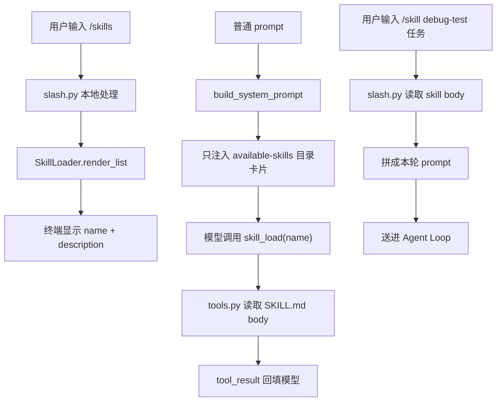
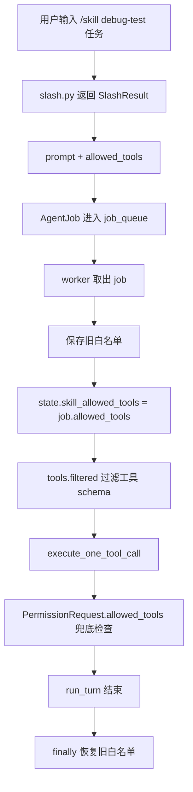

# Day 9：Skills + 按需知识

Day 8 以后，`agent-code` 已经不是一次性脚本了。它有常驻交互 shell、运行时状态、slash 控制面、todo、Plan Mode，还有一套能读写文件、跑命令、问人的工具。

新的问题也跟着来了：项目规则、写作风格、调试流程、发布流程，全都塞进 `AGENT.md` 或 system prompt，迟早会把上下文挤满。

今天做 Skills：把“可能会用到的知识”放在 `.agent/skills/`，启动时只告诉模型有哪些 skill，真正用到时再加载全文。

跑完之后你会看到：

- `/skills` 能列出本地可用 skill，但不消耗一次模型请求
- 模型可以先调用 `skill_list`，再用 `skill_load("debug-test")` 读取完整内容
- `/skill debug-test ...` 会把 skill 正文注入本轮任务，并在这一轮里收敛工具白名单
- `/output-style use explanatory` 能临时切换回答风格，退出进程后不持久化

代码约 620 行，新增代码约 360 行。

今天分四个版本：

1. v1 做 `SKILL.md` 约定和 `/skills`。
2. v2 做 `skill_list` / `skill_load` 和 `/skill`。
3. v3 把 `allowed_tools` 变成真正的工具边界。
4. v4 加 output-styles，把“知识”和“回答风格”分开。

## 起手：今天的起点

从 Day 8 的 `agent-code` 项目继续改。先放一个最小 skill，后面每一版都用它验证。

在项目根目录执行：

```bash
$ mkdir -p .agent/skills/debug-test
$ cat > .agent/skills/debug-test/SKILL.md <<'EOF'
---
name: debug-test
description: Debug failing Python tests by reading errors, inspecting related files, and proposing the smallest fix.
allowed_tools: [read_file, grep]
---

# Debug Test

Use this skill when a Python test fails.

Work in this order:

1. Read the failing test file.
2. Search for the function, class, or fixture named in the failure.
3. Explain the smallest likely fix before editing.
4. Do not edit files unless the current task explicitly allows edits.
EOF
```

这两条命令正常没有输出。现在目录里应该多出一个文件：

```txt
.agent/
  skills/
    debug-test/
      SKILL.md
```

为什么放在 `.agent/`？前几天 session、memory、history、cron 都已经归到这个运行目录里。Skills 也是 harness 的本地能力，放一起方便清理和备份。

## v1：先只把 skill 当成目录约定

`SKILL.md` 里有两层内容：

- frontmatter：`name`、`description`、`allowed_tools`
- body：真正的工作流说明

v1 解析整份 `SKILL.md`（本地小文件，读全文很便宜），但只把 frontmatter 里的 `name` 和 `description` 注入 system prompt。也就是启动时告诉模型“这里有一本叫 `debug-test` 的手册”，body 先留着不进上下文。

这一步先解决两个问题：

1. skill 坏了不能拖垮 CLI。
2. system prompt 里只放 name + description，不放 body。

### 1.1 新增 `agent_code/skills.py`

新建 `agent_code/skills.py`：

```python
from __future__ import annotations

from dataclasses import dataclass
from pathlib import Path


@dataclass(frozen=True)
class SkillMeta:
    name: str
    description: str
    allowed_tools: list[str] | None
    body: str
    path: Path


def _split_frontmatter(text: str) -> tuple[dict[str, str], str]:
    """只解析教程需要的 frontmatter 子集，不引入 YAML 依赖。"""
    if not text.startswith("---\n"):
        return {}, text
    end = text.find("\n---\n", 4)
    if end == -1:
        return {}, text

    raw_frontmatter = text[4:end]
    body = text[end + len("\n---\n") :]
    fields: dict[str, str] = {}
    for line in raw_frontmatter.splitlines():
        if not line.strip() or line.lstrip().startswith("#"):
            continue
        if ":" not in line:
            continue
        key, value = line.split(":", 1)
        fields[key.strip()] = value.strip()
    return fields, body.strip()


def _unquote(value: str) -> str:
    value = value.strip()
    if len(value) >= 2 and value[0] == value[-1] and value[0] in ("'", '"'):
        return value[1:-1]
    return value


def _parse_allowed_tools(raw: str | None) -> list[str] | None:
    """三态：字段缺失=None；[]=禁止工具；[a,b]=只允许列表。"""
    if raw is None:
        return None
    value = raw.strip()
    if value == "[]":
        return []
    if value.startswith("[") and value.endswith("]"):
        inner = value[1:-1].strip()
        if not inner:
            return []
        return [_unquote(part.strip()) for part in inner.split(",") if part.strip()]
    return [_unquote(value)]


class SkillLoader:
    def __init__(self, cwd: Path) -> None:
        self.cwd = cwd
        self.skills_dir = cwd / ".agent" / "skills"
        self.warnings: list[str] = []

    def list(self) -> list[SkillMeta]:
        skills: list[SkillMeta] = []
        if not self.skills_dir.exists():
            return skills

        for skill_md in sorted(self.skills_dir.glob("*/SKILL.md")):
            skill = self._load_file(skill_md)
            if skill is not None:
                skills.append(skill)
        return skills

    def load(self, name: str) -> SkillMeta | None:
        for skill in self.list():
            if skill.name == name:
                return skill
        return None

    def render_list(self) -> str:
        skills = self.list()
        if not skills:
            return "(no skills found)"
        return "\n".join(f"{skill.name}  {skill.description}" for skill in skills)

    def render_available_skills(self) -> str:
        skills = self.list()
        if not skills:
            return ""
        lines = ["<available-skills>"]
        lines.extend(f"- {skill.name}: {skill.description}" for skill in skills)
        lines.append("</available-skills>")
        return "\n".join(lines)

    def _load_file(self, path: Path) -> SkillMeta | None:
        try:
            text = path.read_text(encoding="utf-8")
        except OSError as exc:
            self.warnings.append(f"{path}: {exc}")
            return None

        fields, body = _split_frontmatter(text)
        name = _unquote(fields.get("name", "")).strip()
        description = _unquote(fields.get("description", "")).strip()
        if not name or not description:
            self.warnings.append(f"{path}: missing name or description")
            return None

        return SkillMeta(
            name=name,
            description=description,
            allowed_tools=_parse_allowed_tools(fields.get("allowed_tools")),
            body=body,
            path=path,
        )
```

这里刻意没有引入 `pyyaml`。我们只需要读三种字段，手写一个很小的 parser 更适合今天的主线。

注意 `SkillLoader.list()` 会把 body 也读进 `SkillMeta`——这是为了 v2 的 `skill_load` 复用同一个 loader。v1 的边界不在“读不读 body”，而在“只把 `name` + `description` 注入 system prompt”，body 要等模型按需取。

`allowed_tools` 虽然 v1 还不用，但先解析出来。它的三种含义后面会变成权限边界：

```txt
字段缺失              不收敛工具，沿用默认工具面
allowed_tools: []     纯文本 skill，本轮禁止工具
allowed_tools: [a,b]  本轮只允许 a / b
```

### 1.2 把 skill 列表注入 system prompt

打开 `agent_code/agent.py`，找到 `build_system_prompt(cwd: Path)`。

把函数签名和函数体替换成下面这版，其他代码保留：

```python
def build_system_prompt(cwd: Path, state: RuntimeState | None = None) -> str:
    """组装 system prompt：核心指南 + 项目规则 + 记忆索引 + skill 目录。"""
    from .memdir.store import load_index as load_memory_index
    from .skills import SkillLoader

    parts: list[str] = [_SYSTEM_CORE]

    agent_md = load_agent_md(cwd)
    if agent_md:
        parts.append(agent_md)

    memory_index = load_memory_index(cwd)
    if memory_index:
        parts.append(f"<project-memory>\n{memory_index}\n</project-memory>")

    available_skills = SkillLoader(cwd).render_available_skills()
    if available_skills:
        # 这里只放 skill 目录卡片，不放正文；正文等 skill_load 或 /skill 再加载。
        parts.append(available_skills)

    return "\n\n".join(parts)
```

`state` 现在还没用上。先把参数留出来，是为了 v4 的 output-style 不再改一次函数签名。

### 1.3 新增 `/skills`

打开 `agent_code/slash.py`，在 `_cmd_todo` 后面新增：

```python
def _cmd_skills(_args: list[str], ctx: SlashContext) -> SlashResult:
    from .skills import SkillLoader

    loader = SkillLoader(ctx.cwd)
    message = loader.render_list()
    if loader.warnings:
        message += "\n\nwarnings:\n" + "\n".join(f"- {w}" for w in loader.warnings)
    return SlashResult(handled=True, message=message)
```

再在文件底部注册命令，放在 `register("todo", ...)` 后面：

```python
register("skills", "列出本地 .agent/skills 里的 skill", _cmd_skills)
```

跑一下：

```bash
$ uv run agent-code "/skills"
debug-test  Debug failing Python tests by reading errors, inspecting related files, and proposing the smallest fix.
```

这条命令没有进入模型。它只是本地 slash command：读 `.agent/skills/`，渲染列表，然后结束。

v1 做到了“发现 skill”，但模型还拿不到 skill 正文。现在它只知道 `debug-test` 的一句描述，不知道里面的四步调试流程。

## v2：用到时再加载全文

如果把所有 skill body 都放进 system prompt，`debug-test` 这类短文件还好，等到发布流程、代码审查流程、写作风格都进来，上下文会被常驻知识挤掉。

所以 v2 加两个工具：

```txt
skill_list()
skill_load(name)
```

`skill_list` 像看目录，`skill_load` 像翻到某一页。它们都只是读知识，不改变工具权限。

先把三条入口画出来，后面的代码就是把这三条线接上：



### 2.1 在 `tools.py` 里加两个工具函数

打开 `agent_code/tools.py`，在 `todo_read` 后面新增：

```python
def skill_list(args: dict[str, Any], ctx: ToolContext) -> str:
    """给模型看的 skill 目录；和 /skills 共用同一份 loader。"""
    from .skills import SkillLoader

    loader = SkillLoader(ctx.cwd)
    return loader.render_list()


def skill_load(args: dict[str, Any], ctx: ToolContext) -> str:
    """按需加载 skill 正文。它只返回知识，不改变当前工具白名单。"""
    from .skills import SkillLoader

    name = str(args.get("name", "")).strip()
    if not name:
        return "error: missing required argument 'name'"
    skill = SkillLoader(ctx.cwd).load(name)
    if skill is None:
        return f"error: skill not found: {name}"
    return skill.body
```

再在 `default_tools()` 里，把这两个工具注册到 `todo_read` 后面：

```python
    registry.register(
        Tool(
            name="skill_list",
            description="List available local skills with their descriptions.",
            run=skill_list,
            parameters={"type": "object", "properties": {}, "required": []},
            is_read_only=True,
        )
    )
    registry.register(
        Tool(
            name="skill_load",
            description="Load the full body of a local skill by name.",
            run=skill_load,
            parameters={
                "type": "object",
                "properties": {
                    "name": {"type": "string", "description": "Skill name, e.g. debug-test."},
                },
                "required": ["name"],
            },
            is_read_only=True,
        )
    )
```

### 2.2 权限层把它们当只读工具

打开 `agent_code/permissions.py`，找到 `_READONLY_TOOLS`，把 `skill_list` 和 `skill_load` 加进去：

```python
_READONLY_TOOLS = frozenset({
    "read_file", "list_files", "glob", "grep", "project_tree",
    "git_status", "git_diff",
    "system_date", "echo",
    "memory_recall",
    "cron_list", "todo_read",
    "skill_list", "skill_load",
})
```

现在模型可以自己翻 skill 了。

下面这条命令会请求真实模型。每次新开终端都要先确认已经配好 `ANTHROPIC_AUTH_TOKEN` 或 `ANTHROPIC_API_KEY`，否则会在 provider 初始化时报缺少凭据。这不是 skill 代码错，是模型链路还没连上。

```bash
$ uv run agent-code --max-steps 4 "先调用 skill_list，再调用 skill_load 读取 debug-test，最后用一句话说明这个 skill 的第一步是什么"
Agent Code
cwd: /your/project
provider: anthropic  model: deepseek-v4-pro

tool_call: skill_list {}
tool_call: skill_load {'name': 'debug-test'}
final: debug-test 的第一步是先读取失败的测试文件，确认失败发生在哪里。
```

模型的中文措辞可能不同。关键是看到 `skill_list`、`skill_load` 两个工具调用，而不是一开始就把整份 `SKILL.md` 放进 system prompt。

`skill_load` 的正文是通过 `tool_result` 回填给模型的，但 Day 8 的 `emit` 不会把 `observation:` 打到终端，所以你只会看到 `tool_call` 和 `final`。one-shot 模式还会多打一行 `session: <id>`，本文后面的预期输出为聚焦省略了它。

如果你现在还没配模型 key，先跑一个本地结构检查，确认 harness 这一层已经接好：

```bash
$ uv run python - <<'PY'
from pathlib import Path
from agent_code.permissions import PermissionRequest, decide_permission
from agent_code.tools import ToolContext, default_tools

tools = default_tools()
print(tools.get("skill_list") is not None)
print(tools.get("skill_load") is not None)
print(decide_permission(PermissionRequest("skill_load", {"name": "debug-test"}, "default", Path.cwd())).behavior)
print(tools.get("skill_load").run({"name": "debug-test"}, ToolContext(cwd=Path.cwd())).splitlines()[0])
PY
True
True
allow
# Debug Test
```

这段只能证明工具注册、权限放行和本地读取没问题。它不能替代上面的真实模型验证，因为模型会不会主动发出 `skill_load`，只有真实 tool call 链路能看出来。

### 2.3 `/skill` 把正文注入本轮任务

有时候你不想等模型自己决定要不要加载。你已经知道这轮就要用 `debug-test`，那应该能直接输入：

```txt
/skill debug-test 请检查 tests/test_smoke.py
```

打开 `agent_code/slash.py`，在 `_cmd_skills` 后面新增：

```python
def _cmd_skill(args: list[str], ctx: SlashContext) -> SlashResult:
    from .skills import SkillLoader

    if not args:
        return SlashResult(handled=True, message="用法: /skill <name> [任务]")

    name = args[0]
    task = " ".join(args[1:]).strip() or "按这个 skill 的流程完成当前任务。"
    skill = SkillLoader(ctx.cwd).load(name)
    if skill is None:
        return SlashResult(handled=True, message=f"skill not found: {name}")

    prompt = (
        f"Use this skill for the next task.\n\n"
        f"<skill name=\"{skill.name}\">\n{skill.body}\n</skill>\n\n"
        f"Task: {task}"
    )
    return SlashResult(handled=True, should_query=True, prompt=prompt)
```

底部注册：

```python
register("skill", "用指定 skill 执行本轮任务", _cmd_skill)
```

跑一下。下面命令假设你的项目里有 `tests/test_smoke.py`，没有的话换成任意一个真实存在的测试文件即可：

```bash
$ uv run agent-code --max-steps 6 "/skill debug-test 请检查 tests/test_smoke.py 里最可疑的断言"
Agent Code
cwd: /your/project
provider: anthropic  model: deepseek-v4-pro

tool_call: read_file {'path': 'tests/test_smoke.py'}
...
final: 我先看了 tests/test_smoke.py ...
```

关键是第一个 `tool_call` 就是 `read_file tests/test_smoke.py`——说明 `/skill` 已经把 debug-test 的第一步注入了本轮。任务给得越开放，模型越可能多读几个文件，甚至跑到 `reached max_steps=6` 才停；这一版还没收敛工具面，先不纠结它读了多少，v3 会把工具面收紧。

到这里，`skill_load` 和 `/skill` 已经分开了：

- `skill_load`：模型翻手册，不改变任务边界
- `/skill`：用户明确指定这一轮按某份手册做事

你可能会想：能不能直接输入 `/debug-test 请检查 tests/test_smoke.py`，让 skill 名字自己变成 slash command？

可以做，而且逻辑不复杂。这里先不放进主线，是为了让今天的命令面保持显式：`/skills` 负责列目录，`/skill <name>` 负责执行某个 skill。想自己补的话，有两种做法：

1. 启动时扫描 `SkillLoader.list()`，把每个 skill 注册成一个动态 slash command，例如 `debug-test`。
2. 或者在 `dispatch_slash()` 遇到未知命令时，先拿命令名去 `SkillLoader.load(name)` 查一下；查到就复用 `_cmd_skill([name] + args, ctx)` 的逻辑。

不管用哪种写法，关键都一样：最后还是要返回带 `prompt` 和 `allowed_tools` 的 `SlashResult`，让 v3 的白名单生命周期继续生效。

v2 还缺一块：`SKILL.md` 里的 `allowed_tools` 现在只是文字，没有真的拦工具。

## v3：`allowed_tools` 不能只写在纸上

`debug-test` 的 frontmatter 写了：

```yaml
allowed_tools: [read_file, grep]
```

如果 harness 不执行它，这行只是提醒模型“最好别乱用工具”。但权限不能靠提醒。

v3 做两层保护：

1. 给模型的工具列表先过滤，让它看不到越界工具。
2. 权限层再兜底，就算模型发出了越界 tool call，也返回 deny。

还有一个生命周期问题：`/skill debug-test ...` 的工具白名单只属于这一轮任务，结束后必须恢复。不能因为跑过一次 debug skill，后面的普通对话也只能 `read_file` / `grep`。

这条生命周期先画清楚。`allowed_tools` 不直接写进共享状态，而是跟着一条 job 走：



### 3.1 `RuntimeState` 加本轮 skill 白名单

打开 `agent_code/runtime.py`，找到 `todo_store` 这一行，保留它不动，在它下面新增两行：

```python
    todo_store: list[TodoItem] = field(default_factory=list)   # v5 新增：共享待办板
    skill_allowed_tools: list[str] | None = None               # /skill 本轮任务的临时工具面
    output_style: str | None = None                            # /output-style 改它，当前进程生效
```

`output_style` 这一版暂时不用，v4 会接上。先放这里，避免下一版再回头改同一段。

### 3.2 `SlashResult` 携带本轮白名单

打开 `agent_code/slash.py`，找到 `SlashResult` 类，把整个类替换成下面这版（`__init__` 末尾多了一个 `allowed_tools` 参数，并存到 `self.allowed_tools`）：

```python
class SlashResult:
    """slash command 执行结果。should_query=True 时会把 prompt 送回 Agent Loop。"""

    def __init__(
        self,
        handled: bool = True,
        should_query: bool = False,
        prompt: str = "",
        message: str = "",
        allowed_tools: list[str] | None = None,
    ) -> None:
        self.handled = handled
        self.should_query = should_query
        self.prompt = prompt
        self.message = message
        self.allowed_tools = allowed_tools
```

再回到 `_cmd_skill`，把最后一行改成：

```python
    return SlashResult(
        handled=True,
        should_query=True,
        prompt=prompt,
        allowed_tools=skill.allowed_tools,
    )
```

注意这里没有直接改 `ctx.state.skill_allowed_tools`。slash handler 跑在主线程，如果当前 Agent 还在 worker 里执行，主线程提前改共享状态会污染正在跑的那一轮。

白名单要跟着“下一条 job”走。

### 3.3 交互 shell 的队列项不能再只是字符串

Day 8 的 `job_queue` 里放的是纯字符串——只有 prompt。普通输入这样够用，但 `/skill` 这一轮还要带上自己的 `allowed_tools`。一个字符串装不下两样东西。

所以队列项要从 `str` 升级成带两个字段的对象：

```txt
普通输入      -> AgentJob(prompt="...")
/skill 这一轮 -> AgentJob(prompt="...", allowed_tools=["read_file", "grep"])
```

worker 取到 job 后，先存旧白名单、设上这条 job 的白名单，跑完在 `finally` 里恢复。这样白名单只活一轮，不会泄漏到后面的普通对话。

注意，Day 8 的 `state.input_queue` 仍然只存普通文本。`/skill` 这种会触发 Agent Loop 的 slash command 不走 `input_queue`，它会直接被包装成 `AgentJob` 放进 `job_queue`，所以白名单不会在排队时丢掉。

打开 `agent_code/interactive.py`，在顶部 import 区新增一行 `from dataclasses import dataclass`（`from typing import Any, Callable` 已经存在，保留不动；`asyncio`/`queue`/`threading`/`prompt_toolkit` 等其余 import 也不动）：

```python
from dataclasses import dataclass        # 新增这一行
from typing import Any, Callable          # 已存在，保留不动
# ... 其余 import 全部保留不动 ...
```

在顶部 import 之后、`def run_interactive_shell(...)` 之前，新增一个模块级 `AgentJob`（Day 8 的 `interactive.py` 用的是普通 `print`，没有模块级 `console`，所以锚点选 import 区和函数定义之间）：

```python
@dataclass
class AgentJob:
    prompt: str
    allowed_tools: list[str] | None = None
```

接着把 `run_interactive_shell()` 里的 `job_queue` 和 `worker_loop()` 开头改成下面这版：

```python
    job_queue: "queue.Queue[AgentJob | None]" = queue.Queue()
    busy = threading.Event()

    def worker_loop() -> None:
        while True:
            job = job_queue.get()
            if job is None:
                break
            old_allowed_tools = state.skill_allowed_tools
            state.skill_allowed_tools = job.allowed_tools
            state.abort_event.clear()
            busy.set()
            try:
                run_turn(job.prompt)
            except Exception as exc:
                print(f"[error] {exc}")
            finally:
                state.skill_allowed_tools = old_allowed_tools
                busy.clear()
            while not state.input_queue.empty():
                job_queue.put(AgentJob(state.input_queue.get()))
```

再把 `_run()` 里两处 `job_queue.put(...)` 改掉。

处理 slash result 的地方：

```python
                        if result.should_query:
                            job_queue.put(AgentJob(result.prompt, result.allowed_tools))
```

普通输入入队的地方：

```python
                if busy.is_set():
                    state.input_queue.put(text)
                    print("[queued] turn 结束后自动处理")
                else:
                    job_queue.put(AgentJob(text))
```

最后退出时，把 sentinel 从字符串换成 `None`：

```python
    job_queue.put(None)
```

这一步是 v3 最容易写错的地方。`RuntimeState.skill_allowed_tools` 是共享状态，但它的值必须由 worker 在真正开始跑某个 job 前设置，并在 `finally` 里恢复。

### 3.4 one-shot 路径也要带白名单

交互 shell 修好了，`uv run agent-code "/skill ..."` 这种一次性模式也要一致。

打开 `agent_code/cli.py`，先把 `run_once()` 的参数列表里这行删掉：

```python
    system_prompt: str | None = None,
```

换成：

```python
    skill_allowed_tools: list[str] | None = None,
```

函数尾部创建 state 和调用 `run_agent` 的几行替换成：

```python
    provider = create_provider(provider_name, model, base_url)
    state = RuntimeState(permission_mode=permission_mode, model=model, provider=provider_name)
    state.skill_allowed_tools = skill_allowed_tools
    system_prompt = build_system_prompt(cwd, state)
    run_agent(
        prompt,
        provider,
        default_tools(),
        max_steps=max_steps,
        cwd=cwd,
        state=state,
        session=session,
        system_prompt=system_prompt,
    )
```

然后在 `main_command()` 里删除这行：

```python
    system_prompt = build_system_prompt(resolved_cwd)
```

`run_user_input()` 里，处理 `slash_result.should_query` 的 `run_once(...)` 调用改成：

```python
                run_once(
                    slash_result.prompt, resolved_cwd, provider, model, base_url, max_steps,
                    permission_mode, session=session, skill_allowed_tools=slash_result.allowed_tools,
                )
```

普通 prompt 的 `run_once(...)` 调用改成：

```python
        run_once(
            line, resolved_cwd, provider, model, base_url, max_steps,
            permission_mode, session=session,
        )
```

交互模式里的 `run_turn()` 也要每轮重新组装 prompt。把它替换成：

```python
    def run_turn(line: str) -> None:
        # slash 已在主线程处理过；这里只跑 agent。
        # provider 和 system prompt 都按 RuntimeState 重建，运行时切换下一轮生效。
        turn_provider = create_provider(state.provider, state.model, base_url)
        system_prompt = build_system_prompt(resolved_cwd, state)
        run_agent(
            line, turn_provider, tools, max_steps=max_steps, cwd=resolved_cwd,
            state=state, session=session, system_prompt=system_prompt,
        )
```

这一步顺手修了 v4 会遇到的问题：system prompt 不能在 CLI 启动时只拼一次。Skills 目录和 output-style 都是运行时会变的东西，每轮重建更稳。

### 3.5 工具列表先过滤

打开 `agent_code/tools.py`，在 `ToolRegistry.get()` 后面新增：

```python
    def filtered(self, allowed_names: list[str] | None) -> "ToolRegistry":
        """给模型看的工具面。None 表示不收敛，[] 表示不给任何工具。"""
        if allowed_names is None:
            return self
        registry = ToolRegistry()
        for name in allowed_names:
            tool = self.get(name)
            if tool is not None:
                registry.register(tool)
        return registry
```

打开 `agent_code/agent.py`，找到 loop 里的模型请求：

```python
        response = provider.complete(messages, tools=tools.list(), system=system_prompt)
```

替换成：

```python
        visible_tools = tools.filtered(state.skill_allowed_tools)
        response = provider.complete(messages, tools=visible_tools.list(), system=system_prompt)
```

再往下找到执行工具结果的这段：

```python
        tool_result_blocks = execute_plan_boundary_calls(response.tool_calls, ctx, state, tools, emit)
        if tool_result_blocks is None:
            tool_result_blocks = []
            for batch in partition_tool_calls(response.tool_calls, tools):
                if len(batch) == 1:
                    tool_result_blocks.append(execute_one_tool_call(batch[0], ctx, state, tools, emit))
                else:
                    # 只读组并行。ex.map 按输入顺序返回结果，保证 tool_result 顺序对齐 tool_use。
                    with ThreadPoolExecutor(max_workers=4) as ex:
                        results = list(
                            ex.map(
                                lambda c: execute_one_tool_call(c, ctx, state, tools, emit),
                                batch,
                            )
                        )
                    tool_result_blocks.extend(results)
```

把里面传给 `execute_plan_boundary_calls`、`partition_tool_calls` 和 `execute_one_tool_call` 的 `tools` 都换成 `visible_tools`：

```python
        tool_result_blocks = execute_plan_boundary_calls(response.tool_calls, ctx, state, visible_tools, emit)
        if tool_result_blocks is None:
            tool_result_blocks = []
            for batch in partition_tool_calls(response.tool_calls, visible_tools):
                if len(batch) == 1:
                    tool_result_blocks.append(execute_one_tool_call(batch[0], ctx, state, visible_tools, emit))
                else:
                    # 只读组并行。ex.map 按输入顺序返回结果，保证 tool_result 顺序对齐 tool_use。
                    with ThreadPoolExecutor(max_workers=4) as ex:
                        results = list(
                            ex.map(
                                lambda c: execute_one_tool_call(c, ctx, state, visible_tools, emit),
                                batch,
                            )
                        )
                    tool_result_blocks.extend(results)
```

现在 `/skill debug-test ...` 这一轮里，模型只会看到 `read_file` 和 `grep` 的 schema，执行阶段也只拿到这份过滤后的工具注册表。否则模型如果用历史上下文发出一个越界 tool call，`tools.run()` 仍然可能从原始注册表里找到它。

### 3.6 权限层再兜底

打开 `agent_code/permissions.py`，把 `PermissionRequest` 改成：

```python
@dataclass
class PermissionRequest:
    """一次工具调用的权限请求。工具只描述意图，是否执行交给 harness 决定。"""
    tool_name: str
    args: dict
    mode: str
    cwd: Path
    allowed_tools: list[str] | None = None
```

再在 `decide_permission()` 里，取出 `tool_name` / `args` / `mode` 之后，立刻加上：

```python
    if request.allowed_tools is not None and tool_name not in request.allowed_tools:
        return PermissionDecision(
            "deny",
            f"skill allowed_tools does not allow {tool_name}",
        )
```

打开 `agent_code/agent.py`，找到 `execute_one_tool_call()` 里构造 `PermissionRequest` 的地方，补上 `allowed_tools`：

```python
    request = PermissionRequest(
        tool_name=call.name,
        args=call.arguments,
        mode=state.permission_mode,
        cwd=ctx.cwd,
        allowed_tools=state.skill_allowed_tools,
    )
```

跑两段验证。

第一段看 `/skill` 的工具面会收敛：

```bash
$ uv run agent-code --max-steps 6 "/skill debug-test 请先读 tests/test_smoke.py，然后不要修改文件，只说明最可疑的失败点"
Agent Code
cwd: /your/project
provider: anthropic  model: deepseek-v4-pro

tool_call: read_file {'path': 'tests/test_smoke.py'}
tool_call: read_file {'path': 'agent_code/agent.py'}
tool_call: grep {'pattern': 'def run_agent', 'path': 'agent_code/agent.py'}
...
final: reached max_steps=6
```

这一段要看的不是 `final`，而是这一轮**每个 `tool_call` 都是 `read_file` 或 `grep`**——没有 `file_edit`、`bash`、`glob`、`web_*`。工具池过滤生效后，模型压根看不到越界工具，自然不会去试。模型可能读到 `reached max_steps=6` 才停，没关系，工具面收敛本身已经验证成功。

第二段直接验证权限兜底：

```bash
$ uv run python - <<'PY'
from pathlib import Path
from agent_code.permissions import PermissionRequest, decide_permission

req = PermissionRequest(
    tool_name="file_edit",
    args={"file_path": "tests/test_smoke.py"},
    mode="default",
    cwd=Path.cwd(),
    allowed_tools=["read_file", "grep"],
)
decision = decide_permission(req)
print(decision.behavior)
print(decision.message)
PY
deny
skill allowed_tools does not allow file_edit
```

这就是双保险：

- 工具池过滤：模型正常看不到 `file_edit`
- 权限兜底：漏网的 `file_edit` 也执行不了

## v4：回答风格不要混进 skill

Skills 放的是领域知识和工作流，比如“怎么调试测试失败”“怎么发版”。但“回答要多解释一点”“回答要像 code review 一样短”属于风格。

这两类东西不要混在一起。Skill 是任务知识，output-style 是回答方式。

v4 把风格文件放到：

```txt
.agent/output-styles/<name>.md
```

先准备一个示例：

```bash
$ mkdir -p .agent/output-styles
$ cat > .agent/output-styles/explanatory.md <<'EOF'
---
name: explanatory
description: Explain harness decisions in short teaching paragraphs.
---

When answering:

- Name the harness boundary you are touching.
- Explain why the change belongs there.
- Keep paragraphs short.
- Avoid long lists unless the user asks for a checklist.
EOF
```

正常没有输出。现在我们给 CLI 加 `/output-style`。

### 4.1 在 `skills.py` 末尾加 output-style loader

打开 `agent_code/skills.py`，在文件末尾追加：

```python
@dataclass(frozen=True)
class OutputStyle:
    name: str
    description: str
    body: str
    path: Path


def list_output_styles(cwd: Path) -> list[OutputStyle]:
    styles_dir = cwd / ".agent" / "output-styles"
    if not styles_dir.exists():
        return []

    styles: list[OutputStyle] = []
    for path in sorted(styles_dir.glob("*.md")):
        try:
            text = path.read_text(encoding="utf-8")
        except OSError:
            continue
        fields, body = _split_frontmatter(text)
        name = _unquote(fields.get("name", path.stem)).strip()
        description = _unquote(fields.get("description", "")).strip()
        styles.append(OutputStyle(name=name, description=description, body=body, path=path))
    return styles


def load_output_style(cwd: Path, name: str) -> OutputStyle | None:
    for style in list_output_styles(cwd):
        if style.name == name:
            return style
    return None


def render_output_style(cwd: Path, name: str | None) -> str:
    if not name:
        return ""
    style = load_output_style(cwd, name)
    if style is None:
        return ""
    return f"<output-style name=\"{style.name}\">\n{style.body}\n</output-style>"
```

放在同一个文件里是为了少开一个模块。它和 `SkillLoader` 仍然是两套函数：一个读知识包，一个读风格层。

### 4.2 system prompt 最后追加 style

回到 `agent_code/agent.py` 的 `build_system_prompt()`，在 `available_skills` 这段后面追加：

```python
    if state is not None:
        from .skills import render_output_style

        output_style = render_output_style(cwd, state.output_style)
        if output_style:
            # 风格层放最后：它能影响表达方式，但不应该覆盖项目规则和权限边界。
            parts.append(output_style)
```

最终顺序是：

```txt
core prompt
AGENT.md
<project-memory>
<available-skills>
output-style
```

画成图就是这样：


style 放最后，是因为它管“怎么说”。但它不能改变事实、工具安全和项目规则。

### 4.3 新增 `/output-style`

打开 `agent_code/slash.py`，在 `_cmd_skill` 后面新增：

```python
def _cmd_output_style(args: list[str], ctx: SlashContext) -> SlashResult:
    from .skills import list_output_styles, load_output_style

    if ctx.state is None:
        return SlashResult(handled=True, message="output-style 需要交互 shell")

    subcommand = args[0] if args else "list"
    if subcommand == "list":
        styles = list_output_styles(ctx.cwd)
        if not styles:
            return SlashResult(handled=True, message="(no output styles found)")
        lines = [
            f"{style.name}  {style.description}" if style.description else style.name
            for style in styles
        ]
        current = ctx.state.output_style or "(default)"
        return SlashResult(handled=True, message=f"current: {current}\n" + "\n".join(lines))

    if subcommand == "use":
        if len(args) < 2:
            return SlashResult(handled=True, message="用法: /output-style use <name>")
        name = args[1]
        if load_output_style(ctx.cwd, name) is None:
            return SlashResult(handled=True, message=f"output style not found: {name}")
        ctx.state.output_style = name
        return SlashResult(handled=True, message=f"output style -> {name}")

    if subcommand == "reset":
        ctx.state.output_style = None
        return SlashResult(handled=True, message="output style reset")

    return SlashResult(
        handled=True,
        message="用法: /output-style list | /output-style use <name> | /output-style reset",
    )
```

底部注册：

```python
register("output-style", "列出/切换/重置当前回答风格", _cmd_output_style)
```

### 4.4 状态栏显示当前 style

打开 `agent_code/interactive.py`，找到 `bottom_toolbar()`，把最后两行（`todo = ...` 和 `return ...`）替换成下面三行（上面的 `mode = {...}` 和 `active = next(...)` 两段保留不动）：

```python
    style = f" · style:{state.output_style}" if state.output_style else ""
    todo = f" · {active}" if active else ""
    return f" {mode} · {state.model}{style}{todo} "
```

跑一下交互模式：

```bash
$ uv run agent-code
Agent Code
cwd: /your/project
provider: anthropic  model: deepseek-v4-pro

输入 /help 查看命令，输入 /exit 退出。
> /output-style list
current: (default)
explanatory  Explain harness decisions in short teaching paragraphs.
> /output-style use explanatory
output style -> explanatory
> 解释 skill_load 和 /skill 的区别，短一点
final: `skill_load` 是模型读取知识；`/skill` 是用户指定本轮任务按某份 skill 执行。前者不改工具面，后者会把 `allowed_tools` 绑定到这一轮。
> /output-style reset
output style reset
```

切到 `explanatory` 后，底部状态栏会多出 `style:explanatory`。这不是普通 stdout 的一行输出，而是 prompt_toolkit 底部工具栏的视觉状态。退出进程再进来会恢复默认，因为今天只把 style 放在 `RuntimeState`，不写 settings。

## 收尾：今天改了哪些文件

今天新增一个文件：

```txt
agent_code/skills.py
```

今天改了七个已有文件：

```txt
agent_code/runtime.py       RuntimeState 加 skill_allowed_tools / output_style
agent_code/agent.py         system prompt 注入 skills/style；工具列表按白名单过滤
agent_code/tools.py         新增 skill_list / skill_load；ToolRegistry.filtered
agent_code/permissions.py   PermissionRequest 加 allowed_tools；权限层 deny 越界工具
agent_code/slash.py         /skills /skill /output-style
agent_code/interactive.py   AgentJob 携带本轮 allowed_tools；状态栏显示 style
agent_code/cli.py           每轮重新 build_system_prompt；one-shot /skill 带白名单
```

如果你想做一次完整手动验证，按这个顺序跑：

```bash
$ uv run agent-code "/skills"
debug-test  Debug failing Python tests by reading errors, inspecting related files, and proposing the smallest fix.

$ uv run agent-code --max-steps 4 "调用 skill_load 读取 debug-test，然后说明它要求先做什么"
Agent Code
cwd: /your/project
provider: anthropic  model: deepseek-v4-pro

tool_call: skill_load {'name': 'debug-test'}
final: 它要求先读取失败的测试文件。

$ uv run python - <<'PY'
from pathlib import Path
from agent_code.permissions import PermissionRequest, decide_permission

decision = decide_permission(PermissionRequest("file_edit", {}, "default", Path.cwd(), ["read_file", "grep"]))
print(decision.behavior)
print(decision.message)
PY
deny
skill allowed_tools does not allow file_edit
```

最后开 REPL 试 output-style：

```bash
$ uv run agent-code
> /output-style use explanatory
output style -> explanatory
> /output-style reset
output style reset
```

切换成功后，底部状态栏会显示 `style:explanatory`。

## 手动 trace 一遍

### 路径一：`/skills`

```txt
用户输入：/skills
1. cli.py / interactive.py 先走 dispatch_slash，不进入模型。
2. slash.py 调 SkillLoader(ctx.cwd).render_list()。
3. SkillLoader 扫 .agent/skills/*/SKILL.md。
4. 终端打印 name + description。
5. 本轮结束，没有 LLM call，也没有 session 新消息。
```

### 路径二：模型自己加载 skill

```txt
用户输入：调用 skill_load 读取 debug-test
1. build_system_prompt 把 <available-skills> 注入 system prompt。
2. provider.complete 看到 skill_list / skill_load 两个工具。
3. 模型发 tool_call: skill_load {"name": "debug-test"}。
4. tools.py 读取 .agent/skills/debug-test/SKILL.md 的 body。
5. Agent Loop 把 body 作为 tool_result 回填给模型。
6. 这一条路径不改变 RuntimeState.skill_allowed_tools。
```

### 路径三：用户指定 `/skill`

```txt
用户输入：/skill debug-test 请检查测试
1. slash.py 读取 debug-test，拼出带 <skill> 的 prompt。
2. SlashResult 同时带上 allowed_tools=["read_file", "grep"]。
3. interactive.py 把 prompt + allowed_tools 封进 AgentJob。
4. worker 开始跑 job 前设置 state.skill_allowed_tools。
5. agent.py 给 provider 的 tools 先 filtered，只暴露 read_file / grep。
6. permissions.py 每次工具调用再检查 allowed_tools。
7. run_turn 结束后，worker 在 finally 里恢复旧白名单。
```

### 路径四：`/output-style`

```txt
用户输入：/output-style use explanatory
1. slash.py 验证 .agent/output-styles/explanatory.md 存在。
2. RuntimeState.output_style = "explanatory"。
3. 下一轮 run_turn 前重新 build_system_prompt。
4. agent.py 在最后追加 <output-style name="explanatory">。
5. 模型回答方式变化，但工具权限和项目规则不变。
```

## 今天有了什么

- **Skill 发现**：启动时只把 `name + description` 放进 prompt，让模型知道有哪些知识可用。
- **按需加载**：`skill_load` 让模型在需要时读取正文，避免所有工作流常驻上下文。
- **任务契约**：`/skill <name>` 表示本轮明确使用某份 skill，不只是翻手册。
- **工具面收敛**：`allowed_tools` 同时作用在工具池和权限层，白名单只活一轮。
- **风格层**：output-style 管回答方式，不和任务知识混在一起。

## 常见问题

### `/skills` 显示 `(no skills found)`

先确认你在项目根目录运行 `uv run agent-code`。Skills 目录是相对 `cwd` 查的：

```txt
.agent/skills/<name>/SKILL.md
```

如果你用了 `--cwd`，skill 也要放在那个目录下面。

### `skill_load` 找不到 `debug-test`

检查 `SKILL.md` 的 frontmatter 里有没有 `name: debug-test`。目录名和 skill name 最好一致，但真正用于查找的是 frontmatter 里的 `name`。

### `/skill debug-test` 后普通对话也只能读文件

这说明 `interactive.py` 没有在 `finally` 里恢复 `state.skill_allowed_tools`。回到 v3 的 `worker_loop()`，确认这一段存在：

```python
finally:
    state.skill_allowed_tools = old_allowed_tools
    busy.clear()
```

### `/output-style use explanatory` 后回答没变化

先确认交互模式里的 `run_turn()` 每轮都重新调用了：

```python
system_prompt = build_system_prompt(resolved_cwd, state)
```

如果 system prompt 仍然是在 CLI 启动时只拼一次，style 状态改了，模型也看不到。

## 课后挑战

1. **多行 frontmatter**：把 `allowed_tools` 支持成 YAML 多行数组，而不只是一行 `[read_file, grep]`。
2. **skill 示例库**：写三个本地 skill：`debug-test`、`write-docs`、`review-diff`，比较它们的 `allowed_tools` 应该怎么收敛。
3. **output-style 持久化**：把当前 style 写进 `.agent/settings.json`，下次启动自动恢复。
4. **skill body 附件**：允许 `SKILL.md` 引用同目录下的 `examples/*.md`，`skill_load` 时一起读取。
5. **坏 skill 诊断**：给 `/skills` 增加 `--verbose`，列出被跳过的文件和原因。

## 思考题

1. **为什么 description 可以常驻 prompt，body 不应该常驻？** 提示：想想一个项目里有 20 个 skill 时，哪部分是“目录”，哪部分是“正文”。
2. **`skill_load` 为什么不改变 `RuntimeState.skill_allowed_tools`？** 提示：翻手册和接一单任务不是同一个动作。
3. **工具白名单应该只做工具池过滤，还是只做权限判断？** 提示：分别考虑“模型看不见工具”和“模型仍然发出越界调用”两种情况。
4. **`/skill` 的白名单为什么要跟着 `AgentJob` 进 worker？** 提示：Day 8 以后，主线程和 worker 线程可能同时活着。

## 下一天

今天把“按需知识”接进了单 Agent CLI。

但有些任务不只是需要一份知识，而是需要隔离一条新的执行线：比如让一个 review agent 只读 diff，让一个 docs agent 只写文档，让一个 test agent 专心跑验证。

Day 10 做 Subagents：把 skill 里的工具白名单、prompt 注入和一轮生命周期，升级成可以启动子 Agent 的 harness 边界。
