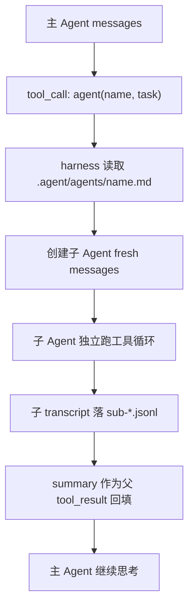

# Day 10：Subagents

Day 9 我们把“按需知识”接进了 CLI：模型知道有哪些 skill，用到时再 `skill_load`，用户也可以用 `/skill` 把某份流程绑定到一轮任务。

但 skill 仍然是在主 Agent 的同一条上下文里工作。读一个大文件、跑一组测试、做一次 review，所有中间过程都会回到主会话里。任务稍微复杂一点，主 Agent 的上下文就会被工具噪声淹掉。

今天做 Subagents：主 Agent 可以把一件子任务委派给一个专门的子 Agent。子 Agent 有自己的 system prompt、自己的 fresh messages、自己的工具面；跑完之后只把结论作为 summary 还给主 Agent。

跑完之后你会看到：

- `/agents` 能列出 `.agent/agents/*.md` 里的子 Agent 模板。
- 模型可以调用 `agent(agent_name, task)` 启动一个同步子 Agent。
- 子 Agent 的完整过程落到 `.agent/sessions/.../sub-*.jsonl`，主会话只收到一条 summary。
- 子 Agent 不继承父 messages，但共享 cwd、权限模式和 ESC 中断信号。
- 子 Agent 的工具池会按模板 `allowed_tools` 收敛，并且永远拿不到 `agent` / `subagent_list`，避免无限递归委派。

代码约 360 行，新增代码约 230 行。

今天分三版：

1. v1 做 agent 模板注册、`/agents`、`subagent_list` 和同步 `agent()`。
2. v2 做 sidechain transcript，让完整子过程落盘，父会话只保留 summary。
3. v3 做工具收敛和递归拦截，把 Day 9 的 `allowed_tools` 规则复用到子 Agent。

## 起手：今天的起点

从 Day 9 的 `agent-code` 项目继续改。先准备三个子 Agent 模板：

```bash
mkdir -p .agent/agents
cat > .agent/agents/code-reviewer.md <<'EOF'
---
name: code-reviewer
description: Review code changes and report concrete risks, bugs, and missing tests.
allowed_tools: [read_file, grep, git_status, git_diff]
---

You are a focused code-review subagent.

Review only the task you were given.
Prioritize bugs, risky behavior changes, missing tests, and unclear failure modes.
Return a concise summary with findings first.
Do not edit files.
EOF

cat > .agent/agents/test-writer.md <<'EOF'
---
name: test-writer
description: Inspect a target module and propose or add focused pytest coverage.
allowed_tools: [read_file, grep, file_write, file_edit]
---

You are a focused test-writing subagent.

Read the relevant implementation and existing tests before writing.
Prefer the smallest test that proves the behavior.
If you edit files, explain what the test covers in the final summary.
EOF

cat > .agent/agents/debugger.md <<'EOF'
---
name: debugger
description: Debug a failing command by reading errors, inspecting code, and identifying the smallest fix.
allowed_tools: [read_file, grep, bash]
---

You are a focused debugging subagent.

Start from the failing command or error text.
Inspect only the files needed to explain the failure.
Return the likely root cause and the smallest next fix.
Do not edit files unless the parent task explicitly asks for that.
EOF
```

现在项目里多了：

```txt
.agent/
  agents/
    code-reviewer.md
    debugger.md
    test-writer.md
```

这三个文件和 Day 9 的 `SKILL.md` 很像，也有 `name`、`description`、`allowed_tools`。区别是：skill body 是给主 Agent 临时加载的工作流；agent body 是子 Agent 自己的 system prompt。

今天的核心边界先画清楚：



注意最关键的一点：子 Agent 不继承父会话 messages。它只收到一条 `task` user message。这样子任务不会把父会话里的讨论、试错和工具结果全背进去。

## v1：能发现，也能同步启动

先把子 Agent 当成一种本地模板：

- `.agent/agents/<name>.md` 是模板文件。
- frontmatter 里的 `name + description` 进入 `<available-agents>`，让模型知道可以委派给谁。
- body 不进主 Agent prompt，只在真正启动子 Agent 时作为子 system prompt。

这和 Day 9 skills 的“目录常驻、正文按需”是同一个思路。不同的是，`agent()` 不是把正文回填给主模型，而是直接启动一条新的 Agent Loop。

### 1.1 新增 `agent_code/subagents.py`

新建 `agent_code/subagents.py`：

```python
from __future__ import annotations

from dataclasses import dataclass
from pathlib import Path

from .skills import _parse_allowed_tools, _split_frontmatter, _unquote


@dataclass(frozen=True)
class AgentTemplate:
    name: str
    description: str
    allowed_tools: list[str] | None
    system_prompt: str
    path: Path


class AgentRegistry:
    def __init__(self, cwd: Path) -> None:
        self.cwd = cwd
        self.agents_dir = cwd / ".agent" / "agents"
        self.warnings: list[str] = []

    def list(self) -> list[AgentTemplate]:
        agents: list[AgentTemplate] = []
        if not self.agents_dir.exists():
            return agents
        for path in sorted(self.agents_dir.glob("*.md")):
            agent = self._load_file(path)
            if agent is not None:
                agents.append(agent)
        return agents

    def load(self, name: str) -> AgentTemplate | None:
        for agent in self.list():
            if agent.name == name:
                return agent
        return None

    def render_list(self) -> str:
        agents = self.list()
        if not agents:
            return "(no agents found)"
        return "\n".join(f"{agent.name}  {agent.description}" for agent in agents)

    def render_available_agents(self) -> str:
        agents = self.list()
        if not agents:
            return ""
        lines = ["<available-agents>"]
        lines.extend(f"- {agent.name}: {agent.description}" for agent in agents)
        lines.append("</available-agents>")
        return "\n".join(lines)

    def _load_file(self, path: Path) -> AgentTemplate | None:
        try:
            text = path.read_text(encoding="utf-8")
        except OSError as exc:
            self.warnings.append(f"{path}: {exc}")
            return None

        fields, body = _split_frontmatter(text)
        name = _unquote(fields.get("name", path.stem)).strip()
        description = _unquote(fields.get("description", "")).strip()
        if not name or not description:
            self.warnings.append(f"{path}: missing name or description")
            return None

        return AgentTemplate(
            name=name,
            description=description,
            allowed_tools=_parse_allowed_tools(fields.get("allowed_tools")),
            system_prompt=body,
            path=path,
        )
```

这里复用了 Day 9 的 frontmatter parser。字段语义也保持一致：

```txt
字段缺失              不收敛工具，继承默认工具面
allowed_tools: []     纯文本子 Agent，禁止工具
allowed_tools: [a,b]  子 Agent 只能用 a / b
```

v1 先把字段读出来，v3 再让它变成真实工具边界。

### 1.2 把可用 agent 目录注入 system prompt

打开 `agent_code/agent.py`，找到 `build_system_prompt()` 里注入 `available_skills` 的那段。

在 `available_skills` 之后、`output_style` 之前追加：

```python
    from .subagents import AgentRegistry

    available_agents = AgentRegistry(cwd).render_available_agents()
    if available_agents:
        # 这里只放子 Agent 目录，不放子 Agent system prompt。
        parts.append(available_agents)
```

这一段最终顺序大概是：

```txt
core prompt
AGENT.md
project-memory
available-skills
available-agents
output-style
```

`available-agents` 只是一张目录卡片。模型知道有 `code-reviewer`、`test-writer`、`debugger`，但看不到它们完整 prompt。真正 spawn 时才加载 body。

### 1.3 新增 `/agents`

打开 `agent_code/slash.py`，在 `_cmd_skills` 后面新增：

```python
def _cmd_agents(_args: list[str], ctx: SlashContext) -> SlashResult:
    from .subagents import AgentRegistry

    registry = AgentRegistry(ctx.cwd)
    message = registry.render_list()
    if registry.warnings:
        message += "\n\nwarnings:\n" + "\n".join(f"- {w}" for w in registry.warnings)
    return SlashResult(handled=True, message=message)
```

再在底部注册，放在 `/skills` 附近：

```python
register("agents", "列出本地 .agent/agents 里的子 Agent 模板", _cmd_agents)
```

先跑一个本地验证：

```bash
$ uv run agent-code "/agents"
code-reviewer  Review code changes and report concrete risks, bugs, and missing tests.
debugger  Debug a failing command by reading errors, inspecting code, and identifying the smallest fix.
test-writer  Inspect a target module and propose or add focused pytest coverage.
```

这条命令和 `/skills` 一样，不进入模型，只读本地模板目录。

### 1.4 给子 Agent 一条 runner

现在要让 `agent()` 工具真的能启动子 Agent。先加一个 runner，v1 只做同步执行，不落子 transcript。

新建 `agent_code/subagent_runner.py`：

```python
from __future__ import annotations

from pathlib import Path

from .agent import build_system_prompt, run_agent
from .model import create_provider
from .runtime import RuntimeState
from .subagents import AgentRegistry, AgentTemplate
from .tools import ToolContext, ToolRegistry, default_tools


RECURSIVE_AGENT_TOOLS = frozenset({"agent", "subagent_list"})


def build_subagent_system_prompt(cwd: Path, state: RuntimeState, template: AgentTemplate) -> str:
    base = build_system_prompt(cwd, state)
    return (
        f"{base}\n\n"
        f"<subagent name=\"{template.name}\">\n"
        f"{template.system_prompt}\n"
        f"</subagent>\n\n"
        "You are running as an isolated subagent. Work only on the task you receive. "
        "Return a concise final summary for the parent agent."
    )


def _child_allowed_tool_names(template: AgentTemplate, tools: ToolRegistry) -> list[str]:
    all_names = [tool.name for tool in tools.list() if tool.name not in RECURSIVE_AGENT_TOOLS]
    if template.allowed_tools is None:
        return all_names
    return [name for name in template.allowed_tools if name in all_names]


def _child_state(parent_state: RuntimeState | None) -> RuntimeState:
    parent_state = parent_state or RuntimeState()
    state = RuntimeState(
        permission_mode=parent_state.permission_mode,
        model=parent_state.model,
        provider=parent_state.provider,
        base_url=parent_state.base_url,
    )
    # ESC 应该能让父 turn 和正在跑的子 turn 都在步间停下来。
    state.abort_event = parent_state.abort_event
    return state


def run_subagent(agent_name: str, task: str, ctx: ToolContext, max_steps: int = 6) -> str:
    registry = AgentRegistry(ctx.cwd)
    template = registry.load(agent_name)
    if template is None:
        return f"error: agent not found: {agent_name}"

    state = _child_state(ctx.runtime_state)
    all_tools = default_tools()
    allowed_names = _child_allowed_tool_names(template, all_tools)
    state.skill_allowed_tools = allowed_names
    child_tools = all_tools.filtered(allowed_names)

    provider = create_provider(state.provider, state.model, state.base_url)
    system_prompt = build_subagent_system_prompt(ctx.cwd, state, template)
    result = run_agent(
        task,
        provider,
        child_tools,
        max_steps=max_steps,
        cwd=ctx.cwd,
        state=state,
        session=None,
        system_prompt=system_prompt,
    )
    return result.final or "(subagent returned no final text)"
```

这里有三个边界值得停一下：

- `messages` 是 fresh 的：`run_agent()` 没有拿父 session，所以它从 `task` 这一条 user message 冷启动。
- `state` 不是父对象本身：子 Agent 共享权限模式、模型和 abort 信号，但不共享父 todo、output-style、临时 skill 白名单。
- 工具池先剔除 `agent` / `subagent_list`：哪怕模板写错，子 Agent 也不能再启动孙 Agent。

不过这段代码引用了 `RuntimeState.base_url`。Day 9 的 `RuntimeState` 还没有这个字段，先补上。

打开 `agent_code/runtime.py`，在 `provider` 后面加一行：

```python
    provider: str = "anthropic"
    base_url: str | None = None
```

再打开 `agent_code/cli.py`，两处创建 `RuntimeState` 的地方都把 `base_url` 传进去。

`run_once()` 里：

```python
    state = RuntimeState(
        permission_mode=permission_mode,
        model=model,
        provider=provider_name,
        base_url=base_url,
    )
```

交互模式里：

```python
    state = RuntimeState(permission_mode=permission_mode, model=model, provider=provider, base_url=base_url)
```

`run_turn()` 里也把 provider 创建改成读状态：

```python
        turn_provider = create_provider(state.provider, state.model, state.base_url)
```

这样子 Agent 和主 Agent 会使用同一套 provider/model/base URL。否则你用 `--base-url` 起了主 CLI，子 Agent 却会退回环境变量默认值，很难排查。

### 1.5 注册 `subagent_list` 和 `agent`

打开 `agent_code/tools.py`，在 `skill_load` 后面新增两个工具函数：

```python
def subagent_list(args: dict[str, Any], ctx: ToolContext) -> str:
    """给模型看的子 Agent 目录；和 /agents 共用同一份 registry。"""
    from .subagents import AgentRegistry

    return AgentRegistry(ctx.cwd).render_list()


def agent(args: dict[str, Any], ctx: ToolContext) -> str:
    """同步启动一个子 Agent。完整隔离边界在 subagent_runner.py。"""
    from .subagent_runner import run_subagent

    agent_name = str(args.get("agent_name", "")).strip()
    task = str(args.get("task", "")).strip()
    if not agent_name:
        return "error: missing required argument 'agent_name'"
    if not task:
        return "error: missing required argument 'task'"
    max_steps = max(1, min(int(args.get("max_steps", 6)), 12))
    return run_subagent(agent_name, task, ctx, max_steps=max_steps)
```

再在 `default_tools()` 里，放在 `skill_load` 注册后面：

```python
    registry.register(
        Tool(
            name="subagent_list",
            description="List available local subagent templates with their descriptions.",
            run=subagent_list,
            parameters={"type": "object", "properties": {}, "required": []},
            is_read_only=True,
        )
    )
    registry.register(
        Tool(
            name="agent",
            description=(
                "Run a focused subagent by template name. Use it for isolated review, "
                "debugging, or test-writing tasks. The subagent receives only the task, "
                "not the parent conversation."
            ),
            run=agent,
            parameters={
                "type": "object",
                "properties": {
                    "agent_name": {"type": "string", "description": "Subagent template name."},
                    "task": {"type": "string", "description": "Focused task for the subagent."},
                    "max_steps": {
                        "type": "integer",
                        "description": "Maximum subagent loop steps, default 6.",
                        "default": 6,
                    },
                },
                "required": ["agent_name", "task"],
            },
            is_read_only=False,
        )
    )
```

最后让权限层认识这两个工具。打开 `agent_code/permissions.py`：

把 `subagent_list` 加进 `_READONLY_TOOLS`：

```python
    "skill_list", "skill_load", "subagent_list",
```

把 `agent` 加进 `_LOW_RISK_WRITES`：

```python
    "todo_write", "enter_plan_mode", "exit_plan_mode",
    "agent",
```

`agent` 本身只是启动子 loop，不直接写文件。子 loop 里的 `file_write`、`file_edit`、`bash` 仍然会走自己的权限判断，所以这里可以放行委派动作本身。

### 1.6 跑验证

先用本地结构检查，不依赖真实模型：

```bash
$ uv run python - <<'PY'
from pathlib import Path
from agent_code.subagents import AgentRegistry
from agent_code.tools import ToolContext, default_tools
from agent_code.runtime import RuntimeState

cwd = Path.cwd()
registry = AgentRegistry(cwd)
print([a.name for a in registry.list()])

tools = default_tools()
print(tools.get("subagent_list") is not None)
print(tools.get("agent") is not None)

ctx = ToolContext(cwd=cwd, runtime_state=RuntimeState(provider="mock", model="mock"))
print(tools.get("subagent_list").run({}, ctx).splitlines()[0])
PY
['code-reviewer', 'debugger', 'test-writer']
True
True
code-reviewer  Review code changes and report concrete risks, bugs, and missing tests.
```

再跑真实模型链路：

```bash
$ uv run agent-code --max-steps 8 "先调用 subagent_list，然后用 agent 工具让 code-reviewer 看一下当前 git diff，只返回最重要的风险"
Agent Code
cwd: /your/project
provider: anthropic  model: deepseek-v4-pro

tool_call: subagent_list {}
tool_call: agent {'agent_name': 'code-reviewer', 'task': 'Review the current git diff and report the most important risks.'}
final: ...
```

你看到的父 trace 里只有 `tool_call: agent ...` 和最终回答。子 Agent 里面具体调了 `git_diff`、`read_file` 还是 `grep`，v1 暂时不会落盘。下一版补上。

## v2：完整过程落子 transcript，父会话只看 summary

v1 已经能同步启动子 Agent，但还有个问题：子 Agent 的中间过程不落盘。出了问题你没法复盘它到底读了什么、用了什么工具、为什么给出那个 summary。

我们要把子过程写进 sidechain transcript：

```txt
父 session:
  user: 请 review
  assistant: tool_use agent(...)
  user: tool_result "<summary>"
  assistant: final

子 session:
  user: Review the current git diff...
  assistant: tool_use git_diff
  user: tool_result ...
  assistant: final "<summary>"
```

父会话只保留 summary，是为了降噪；子 transcript 另存，是为了可查。

### 2.1 `Session.create()` 支持 prefix

打开 `agent_code/session.py`，把 `create()` 方法改成：

```python
    @classmethod
    def create(cls, cwd: Path, prefix: str = "") -> "Session":
        """新建会话：生成 12 位 hex session_id，创建空 JSONL 文件。"""
        sid = prefix + uuid.uuid4().hex[:12]
        file_path = _sessions_dir(cwd) / f"{sid}.jsonl"
        file_path.touch()
        return cls(cwd=cwd, session_id=sid, file_path=file_path, resumed=False)
```

主会话仍然用：

```python
Session.create(resolved_cwd)
```

子会话会用：

```python
Session.create(ctx.cwd, prefix="sub-")
```

路径仍然沿用 Day 6 的 session 目录：

```txt
.agent/sessions/<sanitized-cwd>/sub-xxxxxxxxxxxx.jsonl
```

### 2.2 `run_subagent()` 带上子 session

打开 `agent_code/subagent_runner.py`，顶部加一行：

```python
from .session import Session
```

然后把 `run_agent(... session=None ...)` 那段改成：

```python
    session = Session.create(ctx.cwd, prefix="sub-")
    result = run_agent(
        task,
        provider,
        child_tools,
        max_steps=max_steps,
        cwd=ctx.cwd,
        state=state,
        session=session,
        system_prompt=system_prompt,
    )
    return result.final or "(subagent returned no final text)"
```

这一步没有把子 transcript 路径塞回父 tool_result。父会话仍然只收到 summary。你要查细节时，直接看 `.agent/sessions/.../sub-*.jsonl`。

为什么不把完整 transcript 放进父 tool_result？因为那会破坏 subagent 的意义：主 Agent 又被子过程的工具结果塞满了。

### 2.3 跑验证

先删掉旧的 sub session，方便看这次生成了什么：

```bash
rm -f .agent/sessions/*/sub-*.jsonl
```

然后跑一次子 Agent：

```bash
$ uv run agent-code --max-steps 8 "用 agent 工具让 code-reviewer 总结当前项目顶层结构里最值得注意的一点"
Agent Code
cwd: /your/project
provider: anthropic  model: deepseek-v4-pro

tool_call: agent {'agent_name': 'code-reviewer', 'task': 'Summarize the most important thing to notice about the project top-level structure.'}
final: ...
```

看子 transcript：

```bash
$ ls .agent/sessions/*/sub-*.jsonl
.agent/sessions/.../sub-a1b2c3d4e5f6.jsonl

$ head -n 3 .agent/sessions/*/sub-*.jsonl
{"role":"user","content":"Summarize the most important thing to notice about the project top-level structure.","timestamp":"..."}
...
```

父输出没有打印子过程细节，但磁盘上有完整 JSONL。这个就是今天的降噪边界。

## v3：工具收敛和递归拦截

现在模板里的 `allowed_tools` 已经被 runner 读到了，但我们要明确验证它真的生效。

Day 10 沿用 Day 9 的双保险：

1. 给子模型看的工具 schema 先过滤。
2. 权限层再用同一份白名单兜底。

同时，子 Agent 永远不能调用 `agent` / `subagent_list`。这不是靠 prompt 提醒，而是在工具池里直接剔除。

### 3.1 看懂 `run_subagent()` 里的三层过滤

回到 `agent_code/subagent_runner.py` 这一段：

```python
    all_tools = default_tools()
    allowed_names = _child_allowed_tool_names(template, all_tools)
    state.skill_allowed_tools = allowed_names
    child_tools = all_tools.filtered(allowed_names)
```

这里同时做了两件事：

- `child_tools` 是给 provider 的 schema 面。模型正常看不到越界工具。
- `state.skill_allowed_tools` 是权限兜底。即使模型从旧上下文或幻觉里发出越界 tool call，`decide_permission()` 也会 deny。

而 `_child_allowed_tool_names()` 里先把递归工具剔掉：

```python
all_names = [tool.name for tool in tools.list() if tool.name not in RECURSIVE_AGENT_TOOLS]
```

所以模板就算写成这样：

```yaml
allowed_tools: [agent, read_file]
```

实际给子 Agent 的也只会剩下：

```txt
read_file
```

### 3.2 为什么要禁递归

如果子 Agent 能继续调 `agent()`，模型很容易生成这种链：

```txt
main -> agent(code-reviewer)
code-reviewer -> agent(debugger)
debugger -> agent(test-writer)
...
```

这会让成本、transcript 归属和权限白名单都变得不可解释。今天的目标不是多 Agent 社会，而是“一次性委派，跑完回 summary”。

多 Agent 协作会放到 Day 12 的 coordinator。今天先把单层委派边界锁死。

### 3.3 跑两个验证

第一个验证 `code-reviewer` 的工具面。它只允许：

```txt
read_file, grep, git_status, git_diff
```

直接用本地 Python 看过滤结果：

```bash
$ uv run python - <<'PY'
from pathlib import Path
from agent_code.subagents import AgentRegistry
from agent_code.subagent_runner import _child_allowed_tool_names
from agent_code.tools import default_tools

cwd = Path.cwd()
template = AgentRegistry(cwd).load("code-reviewer")
names = _child_allowed_tool_names(template, default_tools())
print(names)
print("agent" in names)
print("subagent_list" in names)
PY
['read_file', 'grep', 'git_status', 'git_diff']
False
False
```

第二个验证权限兜底。即使子 Agent 试图调用 `file_edit`，也会被白名单挡住：

```bash
$ uv run python - <<'PY'
from pathlib import Path
from agent_code.permissions import PermissionRequest, decide_permission

decision = decide_permission(PermissionRequest(
    tool_name="file_edit",
    args={"file_path": "agent_code/agent.py"},
    mode="default",
    cwd=Path.cwd(),
    allowed_tools=["read_file", "grep", "git_status", "git_diff"],
))
print(decision.behavior)
print(decision.message)
PY
deny
skill allowed_tools does not allow file_edit
```

消息里仍然写着 `skill allowed_tools`，因为 Day 9 的字段名就是这么接进权限层的。你可以把文案改成更通用的 `allowed_tools does not allow ...`，但不影响今天的行为。

最后跑一个真实任务：

```bash
$ uv run agent-code --max-steps 10 "请用 agent 工具让 code-reviewer review 当前 diff。主回答只给它的 summary。"
Agent Code
cwd: /your/project
provider: anthropic  model: deepseek-v4-pro

tool_call: agent {'agent_name': 'code-reviewer', 'task': 'Review the current diff. Return concrete risks first.'}
final: ...
```

如果模型没有主动调用 `agent`，把 prompt 写得更硬一点：

```bash
uv run agent-code --max-steps 10 "必须调用 agent 工具，agent_name=code-reviewer，task=Review the current git diff and summarize findings."
```

今天要验证的是 harness 边界，不是考模型自觉。

### 3.4 还有一种自动 fork

今天做的是手动 subagent：主模型明确调用 `agent()`，子 Agent 跑完，把 summary 作为工具结果还回来。

真实长会话里还会有另一类自动 fork。比如 compact、记忆抽取、进度摘要这些维护任务，不一定是用户或模型显式委派，而是 harness 自己开一条 cache-safe 子循环去整理上下文。那类 fork 追求的是不破坏主请求的缓存前缀、少引入工具副作用，结果通常服务 compact 或 memory，不作为普通 `agent()` 工具结果回填。

我们今天不实现它。先把用户可见的一次性委派讲清楚：fresh task、隔离 transcript、summary 回填。Day 11 做上下文和成本时，再把这种自动维护循环接回来。

## 收尾：今天改了哪些文件

今天新增两个文件：

```txt
agent_code/subagents.py
agent_code/subagent_runner.py
```

今天改了七个已有文件：

```txt
agent_code/runtime.py       RuntimeState 加 base_url，子 Agent 复用 provider 配置
agent_code/agent.py         system prompt 注入 available-agents
agent_code/slash.py         新增 /agents
agent_code/tools.py         新增 subagent_list / agent 两个工具
agent_code/permissions.py   放行 subagent_list / agent，并沿用 allowed_tools 兜底
agent_code/session.py       Session.create(prefix="sub-") 支持子 transcript
agent_code/cli.py           RuntimeState 记录 base_url，run_turn 按 state.base_url 建 provider
```

如果你想做一次完整手动验证，按这个顺序：

```bash
$ uv run agent-code "/agents"
code-reviewer  Review code changes and report concrete risks, bugs, and missing tests.
debugger  Debug a failing command by reading errors, inspecting code, and identifying the smallest fix.
test-writer  Inspect a target module and propose or add focused pytest coverage.

$ uv run python - <<'PY'
from pathlib import Path
from agent_code.subagents import AgentRegistry
from agent_code.subagent_runner import _child_allowed_tool_names
from agent_code.tools import default_tools

template = AgentRegistry(Path.cwd()).load("code-reviewer")
print(_child_allowed_tool_names(template, default_tools()))
PY
['read_file', 'grep', 'git_status', 'git_diff']

$ uv run agent-code --max-steps 10 "必须调用 agent 工具，agent_name=code-reviewer，task=Review the current git diff and summarize findings."
...
```

跑完后检查：

```bash
ls .agent/sessions/*/sub-*.jsonl
```

能看到 `sub-*.jsonl`，说明 sidechain transcript 已经落盘。

## 手动 trace 一遍

### 路径一：`/agents`

```txt
用户输入：/agents
1. cli.py / interactive.py 先走 dispatch_slash，不进入模型。
2. slash.py 调 AgentRegistry(ctx.cwd).render_list()。
3. AgentRegistry 扫 .agent/agents/*.md。
4. 终端打印 name + description。
5. 本轮结束，没有 LLM call，也没有 session 新消息。
```

### 路径二：模型自己委派子 Agent

```txt
用户输入：请让 code-reviewer review 当前 diff
1. build_system_prompt 注入 <available-agents> 目录卡片。
2. provider.complete 看到 agent / subagent_list 两个工具。
3. 主模型发 tool_call: agent {"agent_name":"code-reviewer","task":"..."}。
4. tools.py 调 run_subagent()。
5. subagent_runner 读取 code-reviewer.md，创建 child RuntimeState。
6. child messages 从 [{"role":"user","content":task}] 冷启动，不继承父 messages。
7. child tools 按 allowed_tools 过滤，并剔除 agent / subagent_list。
8. child run_agent 同步跑完，完整 messages 落 sub-*.jsonl。
9. run_subagent 返回 child final summary。
10. 父 Agent 把 summary 当作普通 tool_result 回填，再继续回答。
```

### 路径三：子 Agent 试图越界用工具

```txt
1. code-reviewer 模板 allowed_tools = [read_file, grep, git_status, git_diff]。
2. subagent_runner 把 provider 可见工具过滤到这四个。
3. 如果模型仍然发出 file_edit，execute_one_tool_call 会构造 PermissionRequest。
4. PermissionRequest.allowed_tools 不包含 file_edit。
5. decide_permission 返回 deny。
6. 子 transcript 记录这次 deny，父会话仍只拿最终 summary。
```

## 今天有了什么

- **Agent 模板注册**：`.agent/agents/*.md` 变成可发现的本地子 Agent 模板。
- **`<available-agents>`**：主 Agent 只常驻 name + description，不吞子 prompt 正文。
- **同步 `agent()` 工具**：主 Agent 可以把一个任务委派给子 Agent，并等待 summary 回来。
- **fresh 子上下文**：子 Agent 不继承父 messages，只收到自己的 task。
- **sidechain transcript**：子过程完整落 `sub-*.jsonl`，父会话只保留 summary。
- **工具收敛双保险**：子工具池先过滤，权限层再兜底。
- **递归拦截**：子 Agent 永远拿不到 `agent` / `subagent_list`。

## 常见问题

### `/agents` 显示 `(no agents found)`

确认你在项目根目录运行，且模板路径是：

```txt
.agent/agents/code-reviewer.md
```

Day 10 用的是 `.md` 文件，不是 `.agent/agents/code-reviewer/AGENT.md` 目录。

### `agent` 工具返回 `agent not found`

真正匹配的是 frontmatter 里的 `name`，不是文件名。检查：

```yaml
---
name: code-reviewer
description: ...
---
```

### 子 Agent 没有用到你想要的工具

先看模板里的 `allowed_tools`。如果 `code-reviewer` 只允许 `git_diff` / `read_file` / `grep`，它就看不到 `bash` 和 `file_edit`。

要让 `debugger` 能跑命令，就把任务交给 `debugger`，或者在对应模板里加 `bash`。

### 为什么父会话里看不到子 Agent 的工具细节

这是有意的。父会话只需要 summary，否则 subagent 就失去了降噪价值。

细节在：

```txt
.agent/sessions/<sanitized-cwd>/sub-*.jsonl
```

### 子 Agent 能不能后台跑

今天不做。Day 10 的 `agent()` 是同步工具：父 Agent 等它跑完再继续。

后台 task、`task_output`、`task_stop` 会放到 Day 12。现在先把“隔离上下文 + summary 回填 + transcript 可查”这条边界跑稳。

### 为什么不让子 Agent 继续调用 `agent`

递归委派会让成本、权限和 transcript 归属都变得不可控。今天只做单层委派。多个 Agent 协作会在 Day 12 用 coordinator 重新设计。

## 课后挑战

1. **更友好的 transcript 提示**：让 `agent()` 的 summary 后面附一行本地 transcript 路径，但不要把完整 transcript 放回父会话。
2. **模板校验**：给 `/agents` 加 `--verbose`，列出缺少 `name` / `description` 的坏模板。
3. **只读子 Agent 快捷模板**：写一个 `doc-reader`，`allowed_tools: [read_file, grep, project_tree]`，专门做文档归纳。
4. **子 Agent 最大步数策略**：按模板加 `max_steps` frontmatter，避免每次都由工具参数传。
5. **更通用的权限文案**：把 `skill allowed_tools does not allow ...` 改成 `allowed_tools does not allow ...`，让 skill 和 subagent 共用同一条错误信息。

## 思考题

1. **子 Agent 为什么不继承父 messages？** 提示：父会话里哪些内容对子任务有用，哪些只是噪声？
2. **summary 回填父会话，完整 transcript 另存，这个边界解决了什么问题？** 如果把子 Agent 所有消息都塞回父会话，会发生什么？
3. **子 Agent 共享 cwd 和权限模式，但不共享父 `RuntimeState` 整个对象。** 这避免了哪些状态污染？
4. **为什么要先过滤工具 schema，再在权限层兜底？** 只做其中一层分别会漏掉什么？

## 下一天

今天我们把复杂子任务隔离出去了：主 Agent 发起委派，子 Agent fresh loop 跑完，只把 summary 回来。

下一天会处理更大的上下文问题：长会话会爆 token，工具结果会撑满窗口，compact 不能只靠“消息太多就截掉”。Day 11 做 Context + Cost，让 harness 开始主动管理上下文层级、token 预算和压缩策略。
