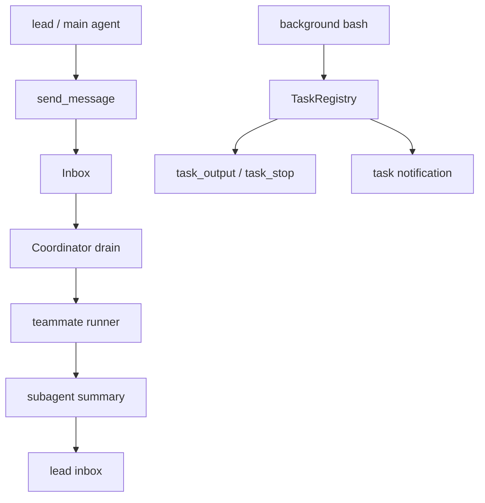

# Day 12：Agent Coordinator

Day 10 的 `agent()` 是一次性委派：主 Agent 把一个任务交给子 Agent，等它跑完，再拿 summary。

今天往前走一步：如果一个任务需要多个角色协作呢？比如 lead 负责拆解，reviewer 看风险，tester 跑验证，docs-writer 写说明。它们不应该都挤在一个 prompt 里，也不应该互相抢当前 turn。

今天做 Agent Coordinator：用 team、inbox、coordinator loop 和 task runtime，把“多个有身份的 Agent”变成 harness 里可观察、可调度、可停止的系统。

跑完之后你会看到：

- `team_create` 能创建一个内存团队，`/team` 能列出成员。
- `send_message(recipient, content)` 只写 inbox，不打断对方当前 turn。
- coordinator 用 round-robin 把 pending message 派给 teammate，再把 summary 回给 lead。
- Day 5 的后台 bash 会登记成 `TaskState`，可用 `task_output` 查、`task_stop` 停。
- worker 完成后用 `<task-notification>` 回流，不在工具执行一半时改 messages。

代码约 620 行，新增约 380 行。

今天分四版：

1. v1：`team_create` / `team_delete` / `/team`。
2. v2：`send_message` 和 inbox。
3. v3：coordinator 调度循环。
4. v4：`task_output` / `task_stop`，把后台 bash 接进统一 task runtime。

## 起手：今天的起点

Day 12 复用前面的能力：

```txt
Day 5  background bash: .bg/<id>.out / .err / pid
Day 8  RuntimeState: 共享运行态、worker 线程、type-ahead
Day 10 subagent runner: fresh task + template prompt + summary
Day 11 context/cost: 不扩展，只尊重安全 turn 边界
```

今天新增四个模块：

```txt
agent_code/inbox.py
agent_code/teammate.py
agent_code/coordinator.py
agent_code/tasks.py
```

先把边界画出来：



今天最重要的原则：**消息和任务完成通知都只在安全边界注入**。不要在某个工具执行到一半时突然往 messages 里插东西。

## v1：先让 team 可见

团队先放内存里，不持久化磁盘。我们只要能创建、删除、查看，就足够进入调度问题。

### 1.1 新增 `agent_code/teammate.py`

```python
from __future__ import annotations

from dataclasses import dataclass


@dataclass
class Teammate:
    name: str
    agent_template: str
    role: str


@dataclass
class Team:
    name: str
    members: list[Teammate]

    def render(self) -> str:
        lines = [f"team: {self.name}"]
        for member in self.members:
            lines.append(f"  - {member.name}: {member.agent_template} ({member.role})")
        return "\n".join(lines)
```

`agent_template` 指向 Day 10 的 `.agent/agents/<name>.md`，`role` 是这个 teammate 在团队里的职责。

### 1.2 `RuntimeState` 加 team registry

打开 `agent_code/runtime.py`：

```python
    teams: dict[str, "Team"] = field(default_factory=dict)
    active_team: str | None = None
```

同样为了避免循环 import，顶部用 `TYPE_CHECKING`：

```python
if TYPE_CHECKING:
    from .teammate import Team
```

### 1.3 新增 team 工具

打开 `agent_code/tools.py`，加三个函数：

```python
def team_create(args: dict[str, Any], ctx: ToolContext) -> str:
    from .teammate import Team, Teammate

    state = ctx.runtime_state
    if state is None:
        return "error: no runtime state"
    name = str(args.get("name", "")).strip()
    raw_members = args.get("members", [])
    if not name:
        return "error: missing required argument 'name'"
    if not isinstance(raw_members, list) or not raw_members:
        return "error: members must be a non-empty list"

    members: list[Teammate] = []
    for item in raw_members:
        members.append(
            Teammate(
                name=str(item.get("name", "")).strip(),
                agent_template=str(item.get("agent_template", "")).strip(),
                role=str(item.get("role", "")).strip(),
            )
        )
    if any(not m.name or not m.agent_template for m in members):
        return "error: each member needs name and agent_template"

    state.teams[name] = Team(name=name, members=members)
    state.active_team = name
    return state.teams[name].render()


def team_delete(args: dict[str, Any], ctx: ToolContext) -> str:
    state = ctx.runtime_state
    if state is None:
        return "error: no runtime state"
    name = str(args.get("name", "")).strip()
    if not name:
        return "error: missing required argument 'name'"
    state.teams.pop(name, None)
    if state.active_team == name:
        state.active_team = None
    return f"team deleted: {name}"


def team_read(args: dict[str, Any], ctx: ToolContext) -> str:
    state = ctx.runtime_state
    if state is None or not state.teams:
        return "(no team)"
    name = str(args.get("name") or state.active_team or "")
    team = state.teams.get(name)
    if team is None:
        return f"team not found: {name}"
    return team.render()
```

注册：

```python
registry.register(Tool(
    name="team_create",
    description="Create an in-memory team. Members point to local subagent templates.",
    run=team_create,
    parameters={
        "type": "object",
        "properties": {
            "name": {"type": "string"},
            "members": {
                "type": "array",
                "items": {
                    "type": "object",
                    "properties": {
                        "name": {"type": "string"},
                        "agent_template": {"type": "string"},
                        "role": {"type": "string"},
                    },
                    "required": ["name", "agent_template", "role"],
                },
            },
        },
        "required": ["name", "members"],
    },
))
registry.register(Tool(
    name="team_delete",
    description="Delete an in-memory team.",
    run=team_delete,
    parameters={
        "type": "object",
        "properties": {"name": {"type": "string"}},
        "required": ["name"],
    },
))
registry.register(Tool(
    name="team_read",
    description="Read the active team.",
    run=team_read,
    parameters={"type": "object", "properties": {}, "required": []},
    is_read_only=True,
))
```

把 `team_read` 加进 `_READONLY_TOOLS`，把 `team_create` / `team_delete` 加进 `_LOW_RISK_WRITES`。

### 1.4 `/team`

打开 `slash.py`：

```python
def _cmd_team(_args: list[str], ctx: SlashContext) -> SlashResult:
    if ctx.state is None or not ctx.state.teams:
        return SlashResult(handled=True, message="(no team)")
    if ctx.state.active_team and ctx.state.active_team in ctx.state.teams:
        return SlashResult(handled=True, message=ctx.state.teams[ctx.state.active_team].render())
    return SlashResult(handled=True, message="\n\n".join(team.render() for team in ctx.state.teams.values()))
```

注册：

```python
register("team", "查看当前团队", _cmd_team)
```

跑验证：

```bash
$ uv run agent-code
> 建一个团队 dev-team，成员 reviewer 使用 code-reviewer，tester 使用 debugger
tool_call: team_create {...}
final: ...
> /team
team: dev-team
  - reviewer: code-reviewer (review code changes)
  - tester: debugger (run failing checks)
```

模型给的 member 文案可能不同。关键是 `/team` 能看到内存 team。

## v2：`send_message` 只写 inbox

现在有 teammate 名字了，但还不能通信。先做 inbox。

`send_message` 不能同步跑 recipient。原因很简单：recipient 可能正在自己的 Agent Loop 里；中途把消息塞进去，会破坏 turn 边界。

### 2.1 新增 `agent_code/inbox.py`

```python
from __future__ import annotations

from dataclasses import dataclass, field
from datetime import datetime, timezone


@dataclass
class InboxMessage:
    sender: str
    recipient: str
    content: str
    timestamp: str


@dataclass
class Inbox:
    messages: dict[str, list[InboxMessage]] = field(default_factory=dict)

    def send(self, sender: str, recipient: str, content: str) -> None:
        msg = InboxMessage(
            sender=sender,
            recipient=recipient,
            content=content,
            timestamp=datetime.now(timezone.utc).isoformat(),
        )
        self.messages.setdefault(recipient, []).append(msg)

    def drain(self, recipient: str) -> list[InboxMessage]:
        pending = self.messages.get(recipient, [])
        self.messages[recipient] = []
        return pending

    def has_pending(self) -> bool:
        return any(bool(items) for items in self.messages.values())


def format_messages(messages: list[InboxMessage]) -> str:
    if not messages:
        return ""
    lines = ["<teammate-messages>"]
    for msg in messages:
        lines.append(f'<message from="{msg.sender}" at="{msg.timestamp}">')
        lines.append(msg.content)
        lines.append("</message>")
    lines.append("</teammate-messages>")
    return "\n".join(lines)
```

### 2.2 `RuntimeState` 挂 inbox

```python
    inbox: "Inbox | None" = None
    current_role: str = "lead"
```

创建 `RuntimeState` 后初始化：

```python
from .inbox import Inbox

state.inbox = Inbox()
```

### 2.3 `send_message` 工具

打开 `tools.py`：

```python
def send_message(args: dict[str, Any], ctx: ToolContext) -> str:
    state = ctx.runtime_state
    if state is None or state.inbox is None:
        return "error: no inbox"
    recipient = str(args.get("recipient", "")).strip()
    content = str(args.get("content", "")).strip()
    if not recipient:
        return "error: missing required argument 'recipient'"
    if not content:
        return "error: missing required argument 'content'"
    sender = getattr(state, "current_role", "lead")
    state.inbox.send(sender, recipient, content)
    return f"message queued for {recipient}"
```

注册：

```python
registry.register(Tool(
    name="send_message",
    description="Send an asynchronous message to a teammate inbox. Does not run the recipient immediately.",
    run=send_message,
    parameters={
        "type": "object",
        "properties": {
            "recipient": {"type": "string"},
            "content": {"type": "string"},
        },
        "required": ["recipient", "content"],
    },
))
```

把 `send_message` 加进 `_LOW_RISK_WRITES`。

### 2.4 drain 时机

`send_message` 只写 inbox。谁来读？在 teammate 下一次 model call 前 drain。

Day 12 主 Agent 自己也可以 drain lead inbox。打开 `agent.py`，provider call 前加：

```python
from .inbox import format_messages

if state.inbox is not None:
    pending = state.inbox.drain(getattr(state, "current_role", "lead"))
    if pending:
        messages.append({"role": "user", "content": format_messages(pending)})
```

这一步要放在 provider.complete 前的安全边界，不要放在工具函数内部。

跑验证：

```bash
> 给 reviewer 发消息，让它稍后 review 当前 diff
tool_call: send_message {'recipient': 'reviewer', 'content': 'Review the current diff.'}
final: ...
```

这时 reviewer 不会立刻跑。消息只是进了 inbox。

## v3：Coordinator 调度循环

现在可以建 team、发消息。下一步让 lead 负责调度。

教学版先做 round-robin，不做并行 swarm。我们要先看清三个东西：队列、调度权、停止条件。

### 3.1 新增 `agent_code/coordinator.py`

```python
from __future__ import annotations

from dataclasses import dataclass

from .inbox import format_messages
from .runtime import RuntimeState
from .subagent_runner import run_subagent
from .tools import ToolContext


@dataclass
class Coordinator:
    state: RuntimeState
    ctx: ToolContext
    max_rounds: int = 3

    def run(self, team_name: str) -> str:
        team = self.state.teams.get(team_name)
        if team is None:
            return f"team not found: {team_name}"
        if self.state.inbox is None:
            return "error: no inbox"

        summaries: list[str] = []
        for round_index in range(self.max_rounds):
            progressed = False
            for teammate in team.members:
                pending = self.state.inbox.drain(teammate.name)
                if not pending:
                    continue
                progressed = True
                task = (
                    f"You are {teammate.name}, role: {teammate.role}.\n\n"
                    f"{format_messages(pending)}\n\n"
                    "Respond with a concise summary for the lead."
                )
                old_role = self.state.current_role
                self.state.current_role = teammate.name
                try:
                    summary = run_subagent(teammate.agent_template, task, self.ctx, max_steps=6)
                finally:
                    self.state.current_role = old_role
                self.state.inbox.send(teammate.name, "lead", summary)
                summaries.append(f"{teammate.name}: {summary}")
            if not progressed:
                break
        return "\n".join(summaries) or "(no pending teammate messages)"
```

teammate 复用 Day 10 的 subagent runner：fresh task、template system prompt、summary 回 lead。

### 3.2 `team_run` 工具

路线图只列了 `team_create/team_delete/send_message`，但 v3 需要一个显式入口让模型触发调度。我们把它叫 `team_run`，也可以放在 `/team run`，这里用工具更贴近 Agent Loop。

```python
def team_run(args: dict[str, Any], ctx: ToolContext) -> str:
    from .coordinator import Coordinator

    state = ctx.runtime_state
    if state is None:
        return "error: no runtime state"
    name = str(args.get("name") or state.active_team or "").strip()
    max_rounds = max(1, min(int(args.get("max_rounds", 3)), 8))
    return Coordinator(state, ctx, max_rounds=max_rounds).run(name)
```

注册：

```python
registry.register(Tool(
    name="team_run",
    description="Run the active team coordinator loop over pending inbox messages.",
    run=team_run,
    parameters={
        "type": "object",
        "properties": {
            "name": {"type": "string"},
            "max_rounds": {"type": "integer", "default": 3},
        },
        "required": [],
    },
))
```

把 `team_run` 加到 `_LOW_RISK_WRITES`。它会启动 subagent，子任务里的写/命令仍走权限。

### 3.3 跑验证

```bash
> 创建 dev-team，成员 reviewer(code-reviewer) 和 tester(debugger)
...
> send_message 给 reviewer：看当前 git diff 的风险；给 tester：说明应该跑什么验证
tool_call: send_message {'recipient': 'reviewer', ...}
tool_call: send_message {'recipient': 'tester', ...}
final: ...
> 调用 team_run 运行 dev-team
tool_call: team_run {'name': 'dev-team', 'max_rounds': 2}
final: reviewer: ...
tester: ...
```

如果模型不主动调 `team_run`，用明确 prompt：

```bash
uv run agent-code "必须调用 team_run，name=dev-team，max_rounds=2"
```

## v4：后台任务统一成 TaskRuntime

Day 5 的后台 bash 已经能跑，但它只返回 `.bg/<id>.out` 和 pid。今天把它接成 `TaskState`，让模型用 `task_output` 和 `task_stop` 统一管理。

### 4.1 新增 `agent_code/tasks.py`

```python
from __future__ import annotations

import os
import time
import uuid
from dataclasses import dataclass, field
from pathlib import Path


@dataclass
class TaskState:
    id: str
    type: str
    status: str
    output_path: Path
    stop_handle: int | None = None
    started_at: float = field(default_factory=time.time)
    ended_at: float | None = None


@dataclass
class TaskRegistry:
    tasks: dict[str, TaskState] = field(default_factory=dict)
    notifications: list[str] = field(default_factory=list)

    def register_bash(self, output_path: Path, pid: int) -> TaskState:
        task = TaskState(
            id="task-" + uuid.uuid4().hex[:8],
            type="bash",
            status="running",
            output_path=output_path,
            stop_handle=pid,
        )
        self.tasks[task.id] = task
        return task

    def finish(self, task_id: str, status: str) -> None:
        task = self.tasks.get(task_id)
        if task is None:
            return
        task.status = status
        task.ended_at = time.time()
        self.notifications.append(
            f"<task-notification>\ntask_id: {task.id}\nstatus: {task.status}\noutput_path: {task.output_path}\n</task-notification>"
        )

    def output(self, task_id: str, block: bool = False, timeout: float | None = None) -> str:
        task = self.tasks.get(task_id)
        if task is None:
            return f"error: task not found: {task_id}"
        deadline = time.time() + (timeout or 0)
        while block and task.status == "running" and timeout is not None and time.time() < deadline:
            time.sleep(0.2)
        text = task.output_path.read_text(encoding="utf-8", errors="replace") if task.output_path.exists() else ""
        preview = text[-4000:] if len(text) > 4000 else text
        return f"task: {task.id}\nstatus: {task.status}\noutput_path: {task.output_path}\n\n{preview}"

    def stop(self, task_id: str) -> str:
        task = self.tasks.get(task_id)
        if task is None:
            return f"error: task not found: {task_id}"
        if task.type == "bash" and task.stop_handle:
            try:
                os.kill(task.stop_handle, 15)
            except OSError as exc:
                return f"error: {exc}"
        task.status = "stopped"
        task.ended_at = time.time()
        return f"stopped: {task.id}"
```

### 4.2 RuntimeState 挂 task registry

```python
    tasks: "TaskRegistry | None" = None
```

CLI 初始化：

```python
from .tasks import TaskRegistry

state.tasks = TaskRegistry()
```

### 4.3 background bash 登记 task

打开 `tools.py` 的 `bash()`。`background=True` 分支现在返回 `.bg` 信息。改成：

```python
if background:
    from .bg_manager import start_background

    result = start_background(command, ctx.cwd)
    state = ctx.runtime_state
    if state is not None and state.tasks is not None:
        task = state.tasks.register_bash(Path(result["output_file"]), int(result["pid"]))
        return (
            f"task_id: {task.id}\n"
            f"status: {task.status}\n"
            f"output_path: {task.output_path}\n"
            f"pid: {task.stop_handle}"
        )
    return ...
```

最小版还不能自动知道进程什么时候结束。可以在 `bg_manager` 的 wait 线程里回调 `state.tasks.finish(task.id, "done")`，或者 v4 先让 `task_output` 读取文件并显示 `running`。如果要完成回流，就把 wait callback 接上。

### 4.4 `task_output` / `task_stop`

`tools.py`：

```python
def task_output(args: dict[str, Any], ctx: ToolContext) -> str:
    state = ctx.runtime_state
    if state is None or state.tasks is None:
        return "error: no task registry"
    task_id = str(args.get("task_id", "")).strip()
    block = bool(args.get("block", False))
    timeout = args.get("timeout")
    return state.tasks.output(task_id, block=block, timeout=float(timeout) if timeout else None)


def task_stop(args: dict[str, Any], ctx: ToolContext) -> str:
    state = ctx.runtime_state
    if state is None or state.tasks is None:
        return "error: no task registry"
    task_id = str(args.get("task_id", "")).strip()
    return state.tasks.stop(task_id)
```

注册：

```python
registry.register(Tool(
    name="task_output",
    description="Read output from a background task.",
    run=task_output,
    parameters={
        "type": "object",
        "properties": {
            "task_id": {"type": "string"},
            "block": {"type": "boolean", "default": False},
            "timeout": {"type": "number"},
        },
        "required": ["task_id"],
    },
    is_read_only=True,
))
registry.register(Tool(
    name="task_stop",
    description="Stop a running background task.",
    run=task_stop,
    parameters={
        "type": "object",
        "properties": {"task_id": {"type": "string"}},
        "required": ["task_id"],
    },
))
```

权限：`task_output` 只读，`task_stop` 放 `_LOW_RISK_WRITES` 或默认 ask。教学版建议 `task_stop` 走 ask，避免误杀进程。

### 4.5 task notification 回流

在 `agent.py` provider call 前，加一个安全边界：

```python
if state.tasks is not None and state.tasks.notifications:
    notices = "\n\n".join(state.tasks.notifications)
    state.tasks.notifications.clear()
    messages.append({"role": "user", "content": notices})
```

worker 线程结束时只写 notification 队列，不直接改当前 messages。下一轮安全边界再注入。

跑验证：

```bash
> 用 bash 后台执行 python -c "import time; time.sleep(2); print('done')"，然后返回 task_id
tool_call: bash {'command': 'python -c "...', 'background': True}
final: task_id: task-...
> 查询这个 task 的输出
tool_call: task_output {'task_id': 'task-...', 'block': True, 'timeout': 5}
final: ... done
```

## 收尾：今天改了哪些文件

今天新增四个文件：

```txt
agent_code/inbox.py
agent_code/teammate.py
agent_code/coordinator.py
agent_code/tasks.py
```

今天改了六个已有文件：

```txt
agent_code/runtime.py      team / inbox / tasks 状态
agent_code/tools.py        team_* / send_message / team_run / task_* 工具
agent_code/permissions.py  工具权限分类
agent_code/slash.py        /team
agent_code/agent.py        inbox drain + task notification 安全注入
agent_code/cli.py          初始化 Inbox / TaskRegistry
```

## 手动 trace 一遍

### 路径一：send_message

```txt
1. 主模型调用 send_message(recipient="reviewer")。
2. 工具只写 state.inbox，不启动 reviewer。
3. 当前 turn 继续正常结束。
4. coordinator 或 reviewer 下一轮启动前 drain inbox。
5. pending 消息变成 <teammate-messages> 注入 teammate user prompt。
```

### 路径二：coordinator

```txt
1. lead 创建 team。
2. lead 给 reviewer/tester 发消息。
3. team_run 读取 active team。
4. round-robin 遍历成员，谁有 pending 就调用 Day 10 subagent runner。
5. teammate summary 发回 lead inbox。
6. 达到 max_rounds 或没有 pending 后停止。
```

### 路径三：background bash task

```txt
1. bash(background=True) 启动进程。
2. TaskRegistry 生成 task_id，记录 pid/output_path。
3. 模型后续用 task_output(task_id) 查输出。
4. 需要停止时用 task_stop(task_id)。
5. 完成通知排进 notifications，在下一轮安全边界回流。
```

## 今天有了什么

- **Team registry**：团队和成员可见。
- **Inbox**：消息异步投递，不打断当前 turn。
- **Coordinator**：lead 用 round-robin 调度 teammate。
- **Teammate runner**：复用 Day 10 subagent，不把完整 transcript 灌回主会话。
- **Task runtime**：后台 bash 有统一 `task_id`，可查、可停、可回流。

## 常见问题

### 为什么 `send_message` 不直接运行 recipient？

因为 recipient 可能正在自己的回合里。同步插消息会破坏工具调用配对，也会让调度顺序不可解释。

### 为什么 coordinator 不并行？

教学版先用 round-robin 讲清楚队列、调度和停止条件。真正并行 worker 会引入锁、取消、输出回流和 UI 问题，适合后续扩展。

### `task_output` 和 TodoWrite 是一回事吗？

不是。TodoWrite 是模型规划任务列表；`task_output` / `task_stop` 是运行时后台进程 IO。一个管计划，一个管进程。

### task notification 为什么不立刻进 messages？

worker 线程不能在主 Agent 的 tool batch 中间改 messages。notification 要排队，在下一轮 provider call 前注入。

## 课后挑战

1. 给 `/team` 增加 `create/delete/run` 子命令。
2. 把 inbox 持久化到 `.agent/inbox.jsonl`。
3. 让 `team_run` 支持并行 teammate。
4. 给 TaskRegistry 加 `/tasks` 列表。
5. 把异步 subagent worker 也登记成 `TaskState(type="subagent")`。

## 思考题

1. **为什么 inbox drain 要放在下一轮 LLM call 前？**
2. **coordinator 的停止条件为什么必须有 `max_rounds`？**
3. **`send_message` 和 `agent()` 的区别是什么？一个是投递，一个是调用。**
4. **后台任务完成后，为什么要用 notification 队列回流？**

## 下一天

今天我们让多个 Agent 能协作，也让后台任务有了统一 IO。下一天解决另一个实际问题：Agent 直接改主分支太危险。Day 13 会把当前工作切进 git worktree，在隔离目录里修 bug、跑测试，再合回主分支。
